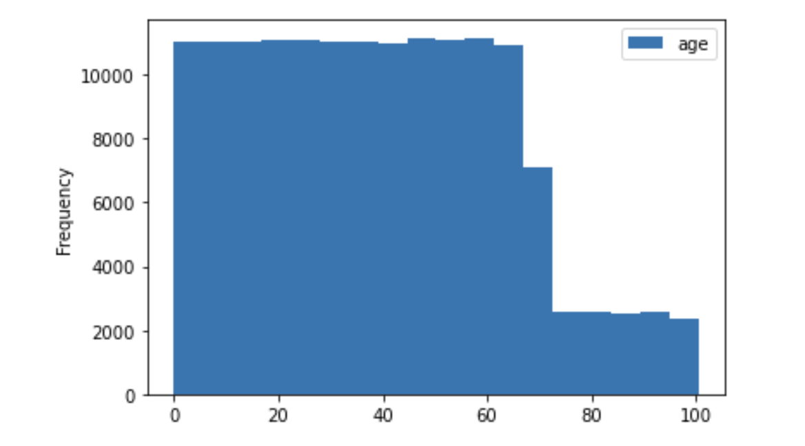
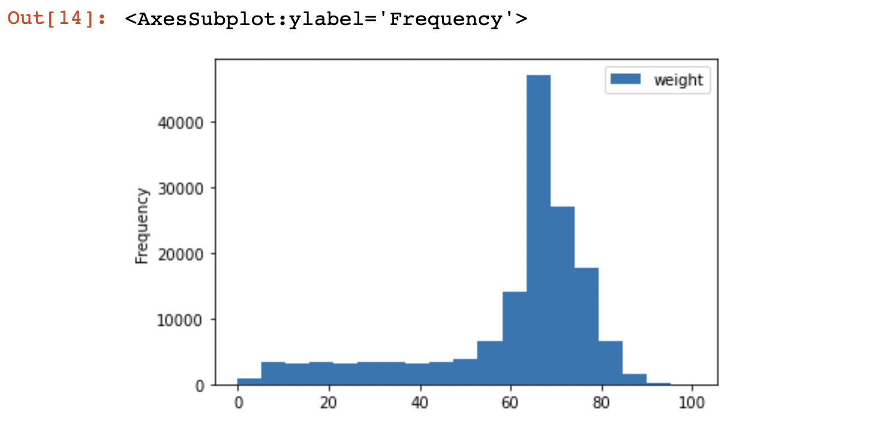
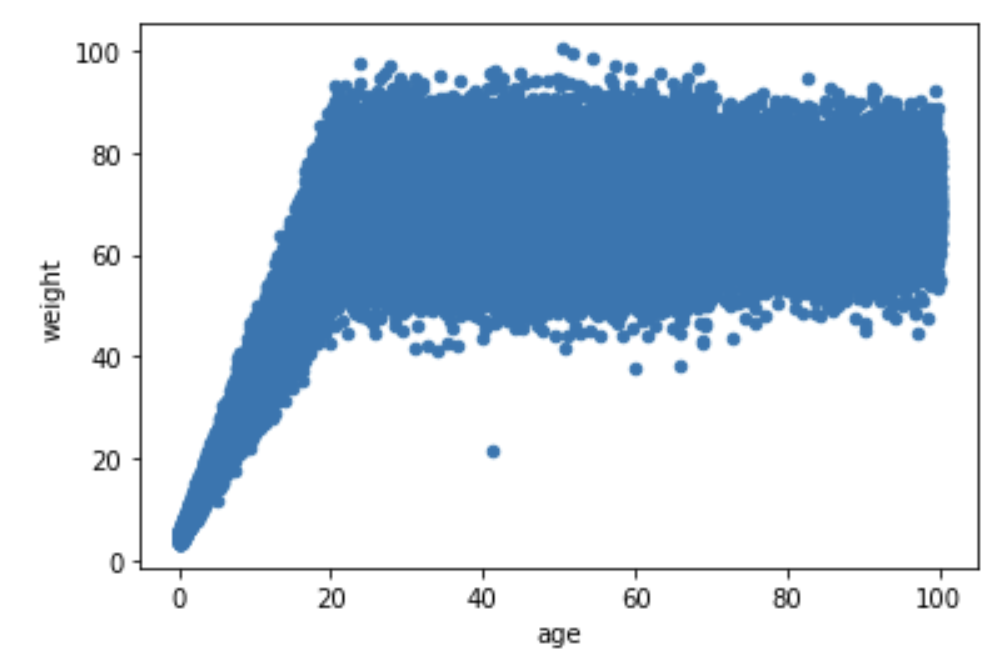
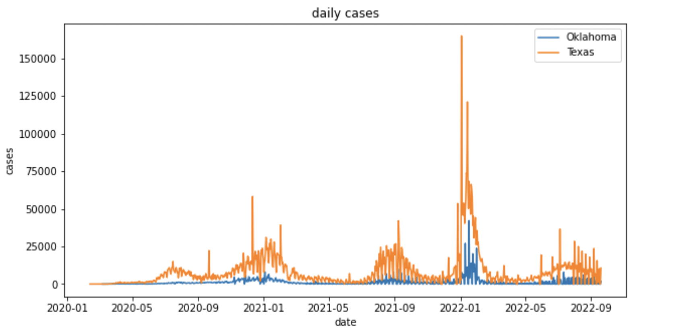
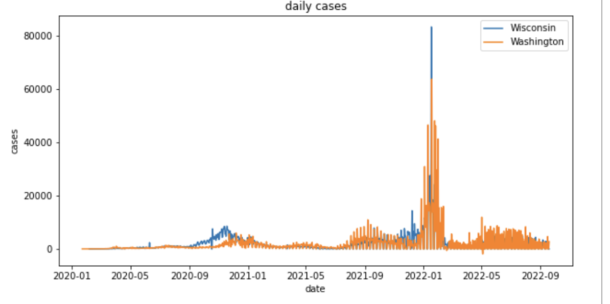

# Assignment 1
## Problem 1
Below is the body of function temp_tester
```python
def temp_tester(normal_temp):
    def judge_normal(temp):
        if abs(temp - normal_temp) <= 1:
            print('True -- i.e. not a fever')
            return True

        if abs(temp - normal_temp) > 1:
            temp_f = normal_temp * 1.8 + 32
            if abs(temp - temp_f) <= 1:
                print('False -- normal in degrees F but our reference temp was in degrees C')
            elif temp - normal_temp > 0:
                print('False -- this would be a severe fever')
            else:
                print('False -- too low')
            return False
    return judge_normal
```
Below are the tests and answers
```python
>>>human_tester = temp_tester(37)
>>>chicken_tester = temp_tester(41.1)

>>>chicken_tester(42)
>>>human_tester(42)   
>>>chicken_tester(43) 
>>>human_tester(35)   
>>human_tester(98.6) 

True -- i.e. not a fever
False -- this would be a severe fever
False -- this would be a severe fever
False -- too low
False -- normal in degrees F but our reference temp was in degrees C
```
## Problem 2
```python
import pandas as pd
import numpy as np
import sqlite3
with sqlite3.connect("hw1-population.db") as db:
    data = pd.read_sql_query("SELECT * FROM population", db)
```
>What columns does it have? 

There are four columns: name, age, weight, eyecolor
```python
# check columns
data.head()
```
>How many rows (think: people) does it have? 

It has 152361 people
```python
# check row number
len(data)
```
> Examine the distribution of the ages in the dataset

Mean = 39.510527927396524

Standard Deviation = 24.152760068601445

Min = 0.0007476719217636152

Max = 99.99154733076972

```python
data.age.mean()
data.age.std()
data.age.min()
data.age.max()
```

>Plot a histogram of the distribution with an appropriate number of bins for the size of the dataset

In my code, I used the Sturges' Rule to calculate the appropriate number of bins:

    bins = ceil(1+log2N) = ceil(18.21713) = 19 


```python
data.hist(column = 'age', bins = 19)
```
Below is the histogram with age 

>Comment on any outliers or patterns you notice in the distribution of ages

The histogram with age as the column is skewed to the right. The number of people drop sharply when the age comes to 60.

> Examine the distribution of the weight in the dataset

Mean = 60.88413415993031

Standard Deviation = 18.411824265661494

Min = 3.3820836824389326

Max = 100.43579300336947

```python
data.weight.mean()
data.weight.std()
data.weight.min()
data.weight.max()
```
>Plot a histogram of the distribution 
```python
data.plot.hist(column = 'weight', bins = 19)
```
Below is the histogram with age 

>Comment on any outliers or patterns you notice in the distribution of weights

The graph is slightly skewed to the left. The number of people increase sharply and reaches a peak when the weight comes to 60 

>Make a scatterplot of the weights vs the ages
```python
data.plot.scatter(x = 'age', y = 'weight')
```
Below is the scatterplot

>Describe the general relationship between the two variables

In this dataset, weight is increasing linearly as age increases when the age interval is (0,20). In general, the weight of people reaches a peak when people are at the age of 20. After the age of 20, as the age of people increase, the weight of people stays amost the same which appears a line with slope 0 in the scattered plot.

>You should notice at least one outlier that does not follow the general relationship. What is the name of the person?

In the scatterplot, we could notice that there is an individual lying as an extreme outlier with age slightly greater than 40 while weight less than 30.
So in the code, I set (weight<30 && age>40) as the critiria to locate the outlier
```python
print(np.where((data['age'] > 40) & (data['weight'] < 30)))
```
The output of the above code is:
```
(array([537]),)
```

> What is the name of the person? 

So now we successfully locate the row number of the outlier. I used the following code to print all the relative information of this person.
```python
data.iloc[537]
```
The output of above code is: (the name of this person is Anthony Freeman)
```
name        Anthony Freeman
age                    41.3
weight                 21.7
eyecolor              green
Name: 537, dtype: object
```
## Problem 3

About this dataset: I downloaded the data on Sep.20th, 2022. I'm referencing the covid cases data from New York Times and here's the url of the data https://raw.githubusercontent.com/nytimes/covid-19-data/master/us-states.csv.

```python
import pandas as pd
import numpy as np
import matplotlib.pyplot as plt
data = pd.read_csv("us-states.csv")
# to get a general overview of the dataset
data.head(10)
```
I first changed the data type of date from string to date so I could use numpy package and do arithmetic equation with them.
```python
# first transfer the data type from strings to datetime 
data['date'] = pd.to_datetime(data['date'])
```
>Make a function that takes a list of state names and plots their new cases vs date using overlaid line graphs, one for each selected state

>Test the above function and provide examples of it in use

Below is the body of function plot and the tests using two lists of data: ['Oklahoma', 'Texas'] and ['Wisconsin','Washington']
```python
def plot(lst):
    # set the figure size for better visualization
    plt.figure(figsize=(10, 5))
    for state in lst:
        data1 = data[data['state']==state]
        data1['cases'] = data1['cases'].diff()
        plt.plot(data1['date'], data1['cases'], label=state)
    plt.legend()
    plt.title('daily cases')
    plt.xlabel('date')
    plt.ylabel('cases')
    plt.show()
    
# Example to test plot function
lst = ['Oklahoma', 'Texas']
plot(lst)
lst2 = ['Wisconsin','Washington']
plot(lst2)
```
The graph of plots are shown below:(no specific limitations)


>Make a function that takes the name of a state and returns the date of its highest number of new cases.

Below is the body of the function highest_date with several tests:
```python
def highest_date(state):    
    data1 = data[data['state']==state]
    data1['cases'] = data1['cases'].diff()
    date = data1[data1['cases'] == np.max(data1['cases'])]['date']
    return date

highest_date('Alabama')
highest_date('Illinois')
highest_date('Virginia')
```
Here are the outputs of the test above: From the out put, we can conclude that the date of daily new case peak for Alabama is 2022-01-29, Illinois is 2022-01-18, Virginia is 2022-01-10
```
38478   2022-01-29
37877   2022-01-18
37465   2022-01-10
```
> Make a function that takes the names of two states and reports which one had its highest number of daily new cases first and how many days separate that one's peak from the other one's peak. 

Below are the body of the function peak_diff with several tests: 
```python
def peak_diff(state1, state2):
    data1 = data[data['state']==state1]
    data2 = data[data['state']==state2]
    
    data1['cases'] = data1['cases'].diff()
    data2['cases'] = data2['cases'].diff()
    
    date1 = np.min(data1[data1['cases'] == np.max(data1['cases'])]['date'])
    date2 = np.min(data2[data2['cases'] == np.max(data2['cases'])]['date'])
    
    if date1 > date2:
        return state1, (date1 - date2).days
    # when two states reach their new cases peak at the same date
    elif date1 == date2:
        return "These two states reaches the peak at the same date",date1, 0
    else:
        return state2, (date2 - date1).days

peak_diff('Texas', 'Oklahoma')
peak_diff('Connecticut', 'California')
peak_diff('Alabama', 'Texas')
```
Here are the outputs of the test above: 
```

```
