# Exercise 1

#### Use the requests module (or urllib) to use the Entrez API (see slides 5) to identify the PubMed IDs for 1000 Alzheimers papers from 2022 and for 1000 cancer papers from 2022.


```python
import requests
import xml
import xml.etree.ElementTree as ET
import pandas as pd
```


```python
def search(item, year):
    url = f"https://eutils.ncbi.nlm.nih.gov/entrez/eutils/esearch.fcgi?db=pubmed&term={item}&{year}&retmode=xml&retmax=1000"
    r = requests.get(url)
    doc = xml.dom.minidom.parseString(r.text)
    pmid_list = []
    ids = doc.getElementsByTagName("Id")
    for i in range(len(ids)):
        id = ids[i].childNodes[0].data
        pmid_list.append(id) 
    return pmid_list   

result = {"Alzheimer_id" : search("Alzheimer", 2022), "Cancer_id" : search("cancer", 2022)}
df = pd.DataFrame(result)
df.to_csv("find_id.csv")
```

#### Use the Entrez API via requests/urllib to pull the metadata for each such paper found above (both cancer and Alzheimers) (and save a JSON file storing each paper's title, abstract, and the query that found it that is of the general form:

In my code, I still used the "get method" instead of "post method". However, to avoid the problem of having a really long url name, I used 2000 seperate queries.


```python
import json
import time


def get_info(pmid):
    r = requests.get(f"https://eutils.ncbi.nlm.nih.gov/entrez/eutils/efetch.fcgi?db=pubmed&retmode=xml&id={pmid}")
    time.sleep(0.35)
    doc = xml.dom.minidom.parseString(r.text)
    
    title = doc.getElementsByTagName("ArticleTitle")
    t = ''
    if type(i) == xml.dom.minidom.Text:
        t = t + i.wholeText

    abstracts = doc.getElementsByTagName("AbstractText")
    abs_out = ''
    for abstract in abstracts:
        for i in abstract.childNodes:
            if type(i) == xml.dom.minidom.Text:
                abs_out = abs_out + " " + i.wholeText
    
    return t, abs_out
```

For this problem, I used ml.dom.minidom.Text and wholeText to handle the problem of Italics in the abstract texts. For example when id = 36295014, there's italics in the abstract text, and it's handeled well. 

#### Discuss any pros or cons of storing all parts of AbstractText fields.

When id = 36303216, I found that it has multi abstracts. To handle this problem, I used a for loop to concatenate them together with a " " in between. \
The pros of concatenating is that it's more human readable. People are able to read all parts of abstract smoothly.
The cons of this method is that it's slow for the reader to find each part of abstracts(background, method, result, conclusion) comparing to the method of using dictionary. If we are using dictionary, it's easy to find each part by the key name.


```python
def get_abstract(item, keyword):
    out = {}
    url = f"https://eutils.ncbi.nlm.nih.gov/entrez/eutils/esearch.fcgi?db=pubmed&term={item}&retmode=xml&retmax=1000"
    r = requests.get(url)
    doc = xml.dom.minidom.parseString(r.text)
    id_list = []
    ids = doc.getElementsByTagName("Id")
    for i in range(len(ids)):
        id = ids[i].childNodes[0].data
        id_list.append(id) 
        print(i, id)
        t, abs_out= get_info(id)
        
        out[id] = {"ArticleTitle" : t, "AbstractText" : abs_out, "query" : keyword} 
    return out
```


```python
j1 = get_abstract("Alzheimer+AND+2022[pdat]", "alzheimer")
with open('alzheimer_output1.json', 'w') as out_file:
    json.dump(j1, out_file)
```


```python
j2 = get_abstract("cancer+AND+2022[pdat]", "cancer")
with open('cancer_output1.json', 'w') as out_file:
    json.dump(j2, out_file)
```

#### There are of course many more papers of each category, but is there any overlap in the two sets of papers that you identified?
No. There's no overlap. The code to detect any overlaps is defined below:


```python
import pandas as pd

data = pd.read_csv("find_id.csv")
alzheimer_lst = data["Alzheimer_id"].values.tolist()
cancer_lst = data["Cancer_id"].values.tolist()

flag = False
for common in cancer_lst:
    if common in alzheimer_lst:
        print(common)
        flag = True
        break
if flag == False:
    print("No Overlap")
```

    No Overlap


# Exercise 2:

#### compute the SPECTER embedding (a 768-dimensional vector). Keep track of which papers came from searching for Alzheimers, which came from searching for cancer.  Load the papers dictionary and then process your dictionary of papers to find the SPECTER embeddings 
The vectors of Alzheimers paper and cancer papers computed by SPECTOR are stored in embeddings. The first 1000 vectors are Alzheimers vectors and the last 1000 vectors are cancer vectors.


```python
!pip3 install torch torchvision torchaudio
!pip install transformers

```


```python
import json

with open('alzheimer_output1.json', 'r') as f:
    data_alzheimer = json.load(f)
with open('cancer_output1.json', 'r') as f:
    data_cancer = json.load(f)
```


```python
def Merge(dict1, dict2):
    for i in dict2.keys():
        dict1[i]=dict2[i]
    return dict1
data = Merge(data_alzheimer, data_cancer)
```


```python
import tqdm

# we can use a persistent dictionary (via shelve) so we can stop and restart if needed
# alternatively, do the same but with embeddings starting as an empty dictionary
embeddings = {}
for pmid, paper in tqdm.tqdm(data.items()):
    data1 = [paper["ArticleTitle"] + tokenizer.sep_token + paper["AbstractText"]]
    inputs = tokenizer(
        data1, padding=True, truncation=True, return_tensors="pt", max_length=512
    )
    result = model(**inputs)
    # take the first token in the batch as the embedding
    embeddings[pmid] = result.last_hidden_state[:, 0, :].detach().numpy()[0]

```


```python
embeddings = [embeddings[pmid] for pmid in data.keys()]
```


```python
# store the embeddings dictionary into a file to visualize it
with open('embeddings.txt', 'w') as filehandle:
    for i in embeddings:
        filehandle.write(f'{i}\n')
```

#### Apply principal component analysis (PCA) to identify the first three principal components.


```python
from sklearn import decomposition
import pandas as pd

pca = decomposition.PCA(n_components=3)
embeddings_pca = pd.DataFrame(
    pca.fit_transform(embeddings),
    columns=['PC0', 'PC1', 'PC2']
)
embeddings_pca["query"] = [paper["query"] for paper in data.values()]
embeddings_pca.to_csv("embeddings_pca.csv")

```

#### Plot 2D scatter plots for PC0 vs PC1, PC0 vs PC2, and PC1 vs PC2; color code these by the search query used (Alzheimers vs cancer).


```python
import matplotlib.pyplot as plt
import pandas as pd 

# for alzheimer
pca0_al = embeddings_pca.iloc[0:1000, 0].to_list()
pca1_al = embeddings_pca.iloc[0:1000, 1].to_list()
pca2_al = embeddings_pca.iloc[0:1000, 2].to_list()
# for cancer
pca0_ca = embeddings_pca.iloc[1000:2000, 0].to_list()
pca1_ca = embeddings_pca.iloc[1000:2000, 1].to_list()
pca2_ca = embeddings_pca.iloc[1000:2000, 2].to_list()

plt.figure(figsize=(15,7))
plt.scatter(pca0_al, pca1_al)
plt.scatter(pca0_ca, pca1_ca)
plt.title("PC_0 vs PC_1")
plt.xlabel("PC_0")
plt.ylabel("PC_1")
plt.show()

plt.figure(figsize=(15,7))
plt.scatter(pca0_al, pca2_al)
plt.scatter(pca0_ca, pca2_ca)
plt.title("PC_0 vs PC_2")
plt.xlabel("PC_0")
plt.ylabel("PC_2")
plt.show()

plt.figure(figsize=(15,7))
plt.scatter(pca1_al, pca2_al)
plt.scatter(pca1_ca, pca2_ca)
plt.title("PC_1 vs PC_2")
plt.xlabel("PC_1")
plt.ylabel("PC_2")
plt.show()

```


From the graph above, we can see that for both pc0 vs pc1, and pc0 vs pc2, the cluster of Alzheimer vectors and cancer vectors are having nice seperations. And 'pc0 vs pc1' has a even better seperation than 'pc0 vs pc2'.\
It indicates that, pc2 is the worst way to sperate cancer data and alzheimer data. pc0 is the best way to seperate cancer data and alzheimer data, and pc1 is in the middle.

# Exercise 3

#### Write an Explicit Euler method to plot i(t) given s(0), i(0), r(0), beta, gamma, and Tmax


```python
import numpy as np
import matplotlib.pyplot as plt

N = 134000

I0, R0 = 1, 0
S0 = N - I0 - R0
beta, gamma = 2, 1
# T_max is 30
t = np.linspace(0, 30, 30)

def derivative(S, I, R, t, N, beta, gamma):
    #S, I, R = y
    dSdt = -beta * S * I / N
    dIdt = beta * S * I / N - gamma * I
    dRdt = gamma * I
    return dSdt, dIdt, dRdt
```

#### Plot the time course of the number of infected individuals until that number drops below 1 (at which point, we'll assume the disease has run its course). 
It's worth mentioning that I did not take T_max as a parameter. However, I tried a linspace of t and manually set T_max as 30 \
In the graph below, the blue line indicates the graph of infected individuals


```python
def integral(t, N, beta, gamma):
    
    # Explicit Euler Method
    S_new = np.zeros(len(t))
    I_new = np.zeros(len(t)) 
    R_new = np.zeros(len(t)) 
    dSdt = np.zeros(len(t)) 
    dIdt = np.zeros(len(t)) 
    dRdt = np.zeros(len(t))
    
    S_new[0] = S0
    I_new[0] = I0
    R_new[0] = R0
    
    dSdt[0], dIdt[0], dRdt[0] = derivative(S0, I0, R0, t, N, beta, gamma)
    
    for i in range(0, len(t) - 1):
        # delta_t = 1
        S_new[i + 1] = S_new[i] + dSdt[i]
        I_new[i + 1] = I_new[i] + dIdt[i]
        R_new[i + 1] = R_new[i] + dRdt[i]
        dSdt[i+1], dIdt[i+1], dRdt[i+1] = derivative(S_new[i+1], I_new[i+1], R_new[i+1], t, N, beta, gamma)
    return S_new, I_new, R_new

S_new, I_new, R_new = integral(t, N, beta, gamma)

plt.plot(t, I_new, label = 'Infectious People')
plt.plot(t, S_new, label = 'Susceptible People')
plt.plot(t, R_new, label = 'Recovered People')
plt.legend()
plt.show()
```


    
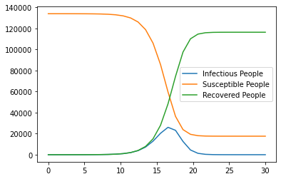
    


#### For those parameter values, when does the number of infected people peak? How many people are infected at the peak? 
From the code below, we can see that the number of infected people at peak is 26033 people, and it was at the day of 16.


```python
I_max = int(max(I_new))

result = list(np.where(I_new == max(I_new)))
print(int(result[0][0]))
print(I_max)
```

    16
    26033


#### Vary these two variables over "nearby" values, and plot on a heat map how the time of the peak of the infection depends on these two variables. Do the same for the number of individuals infected at peak. 

The first heatmap is the number of individuals infected at peak with different beta and gamma. \
The second heatmap is the time of the peak of the infection depends on these two variables. \
To calculate the output of different "nearby values", I set the range of beta as [0.5, 3] and the range of gamma as [0.5, 2]. For each of the beta and gamma, I calculated the number of infectious people at peak and the time at peak. So the total values of each graphs are 21 * 21 = 441 values. And the dataframes are with 21 * 21 values \
The heatmaps I plotted are shown below:


```python
import seaborn as sns
import pandas as pd

beta = np.linspace(0.5, 3, 21)
gamma = np.linspace(0.5, 2, 21)
I_lst = []
I_max = []
t_max = []
I_peak = []

for i in range (21):
    for j in range (21):
        S_new, I_new, R_new = integral(t, N, beta[i], gamma[j])
        I_lst.append(I_new.tolist())

# print(I_lst[0].index(max(I_lst[0])))
for i in range (441):
    I_max.append(int(max(I_lst[i])))
    t_max.append(I_lst[i].index(max(I_lst[i])))

I_peak = [I_max[i:i+21] for i in range(0, len(I_max), 21)]
t_peak = [t_max[i:i+21] for i in range(0, len(t_max), 21)]

```


```python
df = pd.DataFrame(I_peak, index = beta,columns = gamma)
plt.figure(figsize = (10,7))
plt.title('Number of Individuals Infected at Peak')
sns.heatmap(df, annot = False)
plt.xlabel('beta')
plt.ylabel('gamma')
plt.show()
```


    
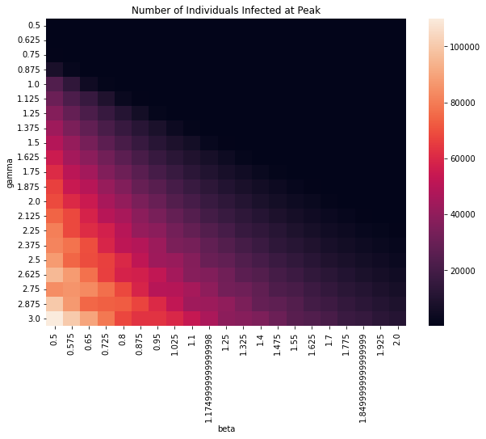
    


```python
df_2 = pd.DataFrame(t_peak, index = beta,columns = gamma)
plt.figure(figsize = (10,7))
plt.title('Time of Individuals Infected at Peak')
sns.heatmap(df_2, annot = False)
plt.xlabel('beta')
plt.ylabel('gamma')
plt.show()
```


    
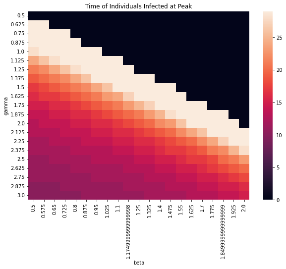
    


# Exercise 4

#### Identify a data set online: 
I'm intrigued by this fetal health data on Kaggle. I want to predict the fetal health using other variables and futher to prevent child and maternal mortality. Everyone is able to access and download it from this link: 
https://www.kaggle.com/datasets/andrewmvd/fetal-health-classification

#### Describe the dataset
##### how many variables? 
There are 22 variables as following: \
-baseline value: The baseline fetal heart rate \
-accelerations: Number of accelerations per second \
-fetal_movement: Number of fetal movements per second \
-uterine_contractions: Number of uterine contractions per second \
-light_decelerations: Number of LDs per second \
-severe_decelerations: Number of SDs per second \ 
-prolongued_decelerations: Number of PDs per second \
-abnormal_short_term_variability: Percentage of time with abnormal short term variability \
-mean_value_of_short_term_variability: Mean value of short term variability \
-percentage_of_time_with_abnormal_long_term_variability: Percentage of time with abnormal long term variability \
-mean_value_of_long_term_variability: Mean value of long term variability \
-histogram_width- Width of FHR histogram
-histogram_min- Minimum (low frequency) of FHR histogram
-histogram_max'- Maximum (high frequency) of FHR histogram
-histogram_number_of_peaks'- Number of histogram peaks
-histogram_number_of_zeroes'- Number of histogram zeros
-histogram_mode'- Histogram mode
-histogram_mean'- Histogram mean
-histogram_median'- Histogram median
-histogram_variance'- Histogram variance
-histogram_tendency'- Histogram tendency
-fetal_health: Fetal health: 1 - Normal 2 - Suspect 3 - Pathological
##### Are the key variables explicitly specified or are they things you would have to derive (e.g. by inferring from text)?
No. All variables are explicitly specified.
##### Are any of the variables exactly derivable from other variables? (i.e. are any of them redundant?) 
The histogram_tendency is a redundancy since it can be derived by histogram mean and histogram variance. 
##### Are there any variables that could in principle be statistically predicted from other variables?
Yes. I think I can predict the fetal health using other variables, such as baseline value, accelerations, fetal_movement, abnormal_short_term_variability, and so on.
##### How many rows/data points are there?
There are 2126 rows of data in this dataset.
##### Is the data in a standard format? If not, how could you convert it to a standard format?
From the dataframe below, we can see that data is in a standard format. Here is basic information. All the values are numerical values and there are no missing values since the count=2126 for all variables


```python
import pandas as pd
df = pd.read_csv('fetal_health.csv')  
df.describe()
```


<div>
<style scoped>
    .dataframe tbody tr th:only-of-type {
        vertical-align: middle;
    }

    .dataframe tbody tr th {
        vertical-align: top;
    }

    .dataframe thead th {
        text-align: right;
    }
</style>
<table border="1" class="dataframe">
  <thead>
    <tr style="text-align: right;">
      <th></th>
      <th>baseline value</th>
      <th>accelerations</th>
      <th>fetal_movement</th>
      <th>uterine_contractions</th>
      <th>light_decelerations</th>
      <th>severe_decelerations</th>
      <th>prolongued_decelerations</th>
      <th>abnormal_short_term_variability</th>
      <th>mean_value_of_short_term_variability</th>
      <th>percentage_of_time_with_abnormal_long_term_variability</th>
      <th>...</th>
      <th>histogram_min</th>
      <th>histogram_max</th>
      <th>histogram_number_of_peaks</th>
      <th>histogram_number_of_zeroes</th>
      <th>histogram_mode</th>
      <th>histogram_mean</th>
      <th>histogram_median</th>
      <th>histogram_variance</th>
      <th>histogram_tendency</th>
      <th>fetal_health</th>
    </tr>
  </thead>
  <tbody>
    <tr>
      <th>count</th>
      <td>2126.000000</td>
      <td>2126.000000</td>
      <td>2126.000000</td>
      <td>2126.000000</td>
      <td>2126.000000</td>
      <td>2126.000000</td>
      <td>2126.000000</td>
      <td>2126.000000</td>
      <td>2126.000000</td>
      <td>2126.00000</td>
      <td>...</td>
      <td>2126.000000</td>
      <td>2126.000000</td>
      <td>2126.000000</td>
      <td>2126.000000</td>
      <td>2126.000000</td>
      <td>2126.000000</td>
      <td>2126.000000</td>
      <td>2126.000000</td>
      <td>2126.000000</td>
      <td>2126.000000</td>
    </tr>
    <tr>
      <th>mean</th>
      <td>133.303857</td>
      <td>0.003178</td>
      <td>0.009481</td>
      <td>0.004366</td>
      <td>0.001889</td>
      <td>0.000003</td>
      <td>0.000159</td>
      <td>46.990122</td>
      <td>1.332785</td>
      <td>9.84666</td>
      <td>...</td>
      <td>93.579492</td>
      <td>164.025400</td>
      <td>4.068203</td>
      <td>0.323612</td>
      <td>137.452023</td>
      <td>134.610536</td>
      <td>138.090310</td>
      <td>18.808090</td>
      <td>0.320320</td>
      <td>1.304327</td>
    </tr>
    <tr>
      <th>std</th>
      <td>9.840844</td>
      <td>0.003866</td>
      <td>0.046666</td>
      <td>0.002946</td>
      <td>0.002960</td>
      <td>0.000057</td>
      <td>0.000590</td>
      <td>17.192814</td>
      <td>0.883241</td>
      <td>18.39688</td>
      <td>...</td>
      <td>29.560212</td>
      <td>17.944183</td>
      <td>2.949386</td>
      <td>0.706059</td>
      <td>16.381289</td>
      <td>15.593596</td>
      <td>14.466589</td>
      <td>28.977636</td>
      <td>0.610829</td>
      <td>0.614377</td>
    </tr>
    <tr>
      <th>min</th>
      <td>106.000000</td>
      <td>0.000000</td>
      <td>0.000000</td>
      <td>0.000000</td>
      <td>0.000000</td>
      <td>0.000000</td>
      <td>0.000000</td>
      <td>12.000000</td>
      <td>0.200000</td>
      <td>0.00000</td>
      <td>...</td>
      <td>50.000000</td>
      <td>122.000000</td>
      <td>0.000000</td>
      <td>0.000000</td>
      <td>60.000000</td>
      <td>73.000000</td>
      <td>77.000000</td>
      <td>0.000000</td>
      <td>-1.000000</td>
      <td>1.000000</td>
    </tr>
    <tr>
      <th>25%</th>
      <td>126.000000</td>
      <td>0.000000</td>
      <td>0.000000</td>
      <td>0.002000</td>
      <td>0.000000</td>
      <td>0.000000</td>
      <td>0.000000</td>
      <td>32.000000</td>
      <td>0.700000</td>
      <td>0.00000</td>
      <td>...</td>
      <td>67.000000</td>
      <td>152.000000</td>
      <td>2.000000</td>
      <td>0.000000</td>
      <td>129.000000</td>
      <td>125.000000</td>
      <td>129.000000</td>
      <td>2.000000</td>
      <td>0.000000</td>
      <td>1.000000</td>
    </tr>
    <tr>
      <th>50%</th>
      <td>133.000000</td>
      <td>0.002000</td>
      <td>0.000000</td>
      <td>0.004000</td>
      <td>0.000000</td>
      <td>0.000000</td>
      <td>0.000000</td>
      <td>49.000000</td>
      <td>1.200000</td>
      <td>0.00000</td>
      <td>...</td>
      <td>93.000000</td>
      <td>162.000000</td>
      <td>3.000000</td>
      <td>0.000000</td>
      <td>139.000000</td>
      <td>136.000000</td>
      <td>139.000000</td>
      <td>7.000000</td>
      <td>0.000000</td>
      <td>1.000000</td>
    </tr>
    <tr>
      <th>75%</th>
      <td>140.000000</td>
      <td>0.006000</td>
      <td>0.003000</td>
      <td>0.007000</td>
      <td>0.003000</td>
      <td>0.000000</td>
      <td>0.000000</td>
      <td>61.000000</td>
      <td>1.700000</td>
      <td>11.00000</td>
      <td>...</td>
      <td>120.000000</td>
      <td>174.000000</td>
      <td>6.000000</td>
      <td>0.000000</td>
      <td>148.000000</td>
      <td>145.000000</td>
      <td>148.000000</td>
      <td>24.000000</td>
      <td>1.000000</td>
      <td>1.000000</td>
    </tr>
    <tr>
      <th>max</th>
      <td>160.000000</td>
      <td>0.019000</td>
      <td>0.481000</td>
      <td>0.015000</td>
      <td>0.015000</td>
      <td>0.001000</td>
      <td>0.005000</td>
      <td>87.000000</td>
      <td>7.000000</td>
      <td>91.00000</td>
      <td>...</td>
      <td>159.000000</td>
      <td>238.000000</td>
      <td>18.000000</td>
      <td>10.000000</td>
      <td>187.000000</td>
      <td>182.000000</td>
      <td>186.000000</td>
      <td>269.000000</td>
      <td>1.000000</td>
      <td>3.000000</td>
    </tr>
  </tbody>
</table>
<p>8 rows × 22 columns</p>
</div>


#### Describe the terms of use and identify any key restrictions (e.g. do you have to officially apply to get access to the data? Are there certain types of analyses you can't do?)
So far I have not seen any type of analyses that I can't do using the dataset I found.
My preliminary plan for the final project is to predict the fetal health using other variables of the fetus. I am thing about doing some logistic regressions on this dataset. 
I think the key restriction may be that the regression result is very significant, because I only have ten independent variables, but a person’s behavior sometimes is more complicated.
The key restriction is that the result may not be highly accurate since for the independent variables, we only have 20 variables to chose from. So we may not be able to reach the significant level we want using those variables. 

#### Do you have to officially apply to get access to the data?
I do not have to offcially apply to get access to the data since it's open source. But I do need to cite the contributor of this dataset: \
Ayres de Campos et al. (2000) SisPorto 2.0 A Program for Automated Analysis of Cardiotocograms. J Matern Fetal Med 5:311-318

#### Identify any data cleaning needs (this includes checking for missing data) and write code to perform them. If the data does not need to be cleaned, explain how you reached this conclusion.
From the code below, we can see that most values in 'severe_decelerations' and 'prolongued_decelerations' are zero. My prediction is that maybe they are actually missing data but it's already cleaned by previous researchers and they impute 0 as the value when there's missing data.


```python
print(df['severe_decelerations'].mode())
print(df['prolongued_decelerations'].mode())
```

    0    0.0
    Name: severe_decelerations, dtype: float64
    0    0.0
    Name: prolongued_decelerations, dtype: float64


As for the data cleaning, I dropped the columns of 'severe_decelerations' and 'prolongued_decelerations' since they contains too many missing data. And I also dropped 'histogram_tendency' since it can be derived from other variables.
Also, in my project, I want to set the independent variables as: baseline value, accelerations, fetal_movement, uterine_contractions, light_decelerations, mean_value_of_short_term_variability, mean_value_of_long_term_variability, histogram_width, histogram_min, histogram_max, histogram_number_of_peaks ,histogram_mode, histogram_mean, histogram_variance. So I will drop all other columns other than the independent variables. 


```python
df = df.drop(columns=['severe_decelerations', 'prolongued_decelerations','histogram_tendency'])
df = df.drop(columns=['abnormal_short_term_variability', 'percentage_of_time_with_abnormal_long_term_variability','histogram_number_of_zeroes'])
df.to_csv('cleaned_fetal_health.csv')
df
```


<div>
<style scoped>
    .dataframe tbody tr th:only-of-type {
        vertical-align: middle;
    }

    .dataframe tbody tr th {
        vertical-align: top;
    }

    .dataframe thead th {
        text-align: right;
    }
</style>
<table border="1" class="dataframe">
  <thead>
    <tr style="text-align: right;">
      <th></th>
      <th>baseline value</th>
      <th>accelerations</th>
      <th>fetal_movement</th>
      <th>uterine_contractions</th>
      <th>light_decelerations</th>
      <th>mean_value_of_short_term_variability</th>
      <th>mean_value_of_long_term_variability</th>
      <th>histogram_width</th>
      <th>histogram_min</th>
      <th>histogram_max</th>
      <th>histogram_number_of_peaks</th>
      <th>histogram_mode</th>
      <th>histogram_mean</th>
      <th>histogram_median</th>
      <th>histogram_variance</th>
      <th>fetal_health</th>
    </tr>
  </thead>
  <tbody>
    <tr>
      <th>0</th>
      <td>120.0</td>
      <td>0.000</td>
      <td>0.000</td>
      <td>0.000</td>
      <td>0.000</td>
      <td>0.5</td>
      <td>2.4</td>
      <td>64.0</td>
      <td>62.0</td>
      <td>126.0</td>
      <td>2.0</td>
      <td>120.0</td>
      <td>137.0</td>
      <td>121.0</td>
      <td>73.0</td>
      <td>2.0</td>
    </tr>
    <tr>
      <th>1</th>
      <td>132.0</td>
      <td>0.006</td>
      <td>0.000</td>
      <td>0.006</td>
      <td>0.003</td>
      <td>2.1</td>
      <td>10.4</td>
      <td>130.0</td>
      <td>68.0</td>
      <td>198.0</td>
      <td>6.0</td>
      <td>141.0</td>
      <td>136.0</td>
      <td>140.0</td>
      <td>12.0</td>
      <td>1.0</td>
    </tr>
    <tr>
      <th>2</th>
      <td>133.0</td>
      <td>0.003</td>
      <td>0.000</td>
      <td>0.008</td>
      <td>0.003</td>
      <td>2.1</td>
      <td>13.4</td>
      <td>130.0</td>
      <td>68.0</td>
      <td>198.0</td>
      <td>5.0</td>
      <td>141.0</td>
      <td>135.0</td>
      <td>138.0</td>
      <td>13.0</td>
      <td>1.0</td>
    </tr>
    <tr>
      <th>3</th>
      <td>134.0</td>
      <td>0.003</td>
      <td>0.000</td>
      <td>0.008</td>
      <td>0.003</td>
      <td>2.4</td>
      <td>23.0</td>
      <td>117.0</td>
      <td>53.0</td>
      <td>170.0</td>
      <td>11.0</td>
      <td>137.0</td>
      <td>134.0</td>
      <td>137.0</td>
      <td>13.0</td>
      <td>1.0</td>
    </tr>
    <tr>
      <th>4</th>
      <td>132.0</td>
      <td>0.007</td>
      <td>0.000</td>
      <td>0.008</td>
      <td>0.000</td>
      <td>2.4</td>
      <td>19.9</td>
      <td>117.0</td>
      <td>53.0</td>
      <td>170.0</td>
      <td>9.0</td>
      <td>137.0</td>
      <td>136.0</td>
      <td>138.0</td>
      <td>11.0</td>
      <td>1.0</td>
    </tr>
    <tr>
      <th>...</th>
      <td>...</td>
      <td>...</td>
      <td>...</td>
      <td>...</td>
      <td>...</td>
      <td>...</td>
      <td>...</td>
      <td>...</td>
      <td>...</td>
      <td>...</td>
      <td>...</td>
      <td>...</td>
      <td>...</td>
      <td>...</td>
      <td>...</td>
      <td>...</td>
    </tr>
    <tr>
      <th>2121</th>
      <td>140.0</td>
      <td>0.000</td>
      <td>0.000</td>
      <td>0.007</td>
      <td>0.000</td>
      <td>0.2</td>
      <td>7.2</td>
      <td>40.0</td>
      <td>137.0</td>
      <td>177.0</td>
      <td>4.0</td>
      <td>153.0</td>
      <td>150.0</td>
      <td>152.0</td>
      <td>2.0</td>
      <td>2.0</td>
    </tr>
    <tr>
      <th>2122</th>
      <td>140.0</td>
      <td>0.001</td>
      <td>0.000</td>
      <td>0.007</td>
      <td>0.000</td>
      <td>0.4</td>
      <td>7.1</td>
      <td>66.0</td>
      <td>103.0</td>
      <td>169.0</td>
      <td>6.0</td>
      <td>152.0</td>
      <td>148.0</td>
      <td>151.0</td>
      <td>3.0</td>
      <td>2.0</td>
    </tr>
    <tr>
      <th>2123</th>
      <td>140.0</td>
      <td>0.001</td>
      <td>0.000</td>
      <td>0.007</td>
      <td>0.000</td>
      <td>0.4</td>
      <td>6.1</td>
      <td>67.0</td>
      <td>103.0</td>
      <td>170.0</td>
      <td>5.0</td>
      <td>153.0</td>
      <td>148.0</td>
      <td>152.0</td>
      <td>4.0</td>
      <td>2.0</td>
    </tr>
    <tr>
      <th>2124</th>
      <td>140.0</td>
      <td>0.001</td>
      <td>0.000</td>
      <td>0.006</td>
      <td>0.000</td>
      <td>0.4</td>
      <td>7.0</td>
      <td>66.0</td>
      <td>103.0</td>
      <td>169.0</td>
      <td>6.0</td>
      <td>152.0</td>
      <td>147.0</td>
      <td>151.0</td>
      <td>4.0</td>
      <td>2.0</td>
    </tr>
    <tr>
      <th>2125</th>
      <td>142.0</td>
      <td>0.002</td>
      <td>0.002</td>
      <td>0.008</td>
      <td>0.000</td>
      <td>0.4</td>
      <td>5.0</td>
      <td>42.0</td>
      <td>117.0</td>
      <td>159.0</td>
      <td>2.0</td>
      <td>145.0</td>
      <td>143.0</td>
      <td>145.0</td>
      <td>1.0</td>
      <td>1.0</td>
    </tr>
  </tbody>
</table>
<p>2126 rows × 16 columns</p>
</div>


#### Do data exploration on the dataset, and present a representative set of figures that gives insight into the data. Comment on the insights gained. 
After plotting 15 histograms on each independent variables, I found that some plots are skewed to the left. \
For 'Accelerations', the histogram plot is skewed to the left and the values is mainly distributed at about 0.002 \
For 'histogram_variance', the histogram plot is skewed to the left and the values is mainly distributed at about 2.5 \
I then plot the scatter plot with 'histogram_variance' & 'fetal_movement' to see if there's any correlation between  fetal heart rate's histogram_variance and fetal_movement. From the histogram, we can see than when the fetal health status is 'Pathological' (when fetal_health.value() == 3), the fetal movement is always approximately zero regardless the value of variance. And this makes fetal movement an interesting factor for predicting the fetal health.


```python
import matplotlib.pyplot as plt
df.iloc[:, 0].hist()
plt.xlabel("Baseline Heart rate")
plt.ylabel("Frequency")
plt.savefig("Figure_1.png")
plt.show()
```


    
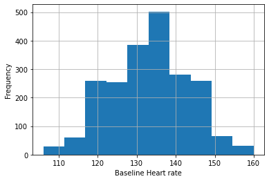
    


```python
df.iloc[:, 1].hist()
plt.xlabel("Accelerations")
plt.ylabel("Frequency")
plt.savefig("Figure_2.png")
plt.show()
```


    
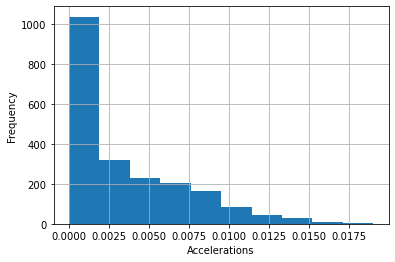
    


```python
df.iloc[:, 2].hist()
plt.xlabel("fetal_movement")
plt.ylabel("Frequency")
plt.savefig("Figure_3.png")
plt.show()
```


    
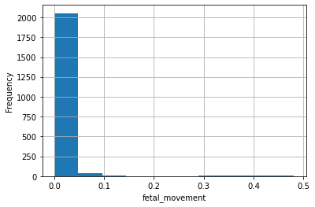
    


```python
df.iloc[:, 3].hist()
plt.xlabel("uterine_contractions")
plt.ylabel("Frequency")
plt.savefig("Figure_4.png")
plt.show()

```


    
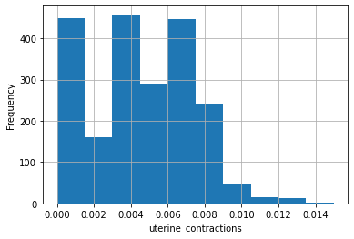
    


```python
df.iloc[:, 4].hist()
plt.xlabel("light_decelerations")
plt.ylabel("Frequency")
plt.savefig("Figure_5.png")
plt.show()
```


    
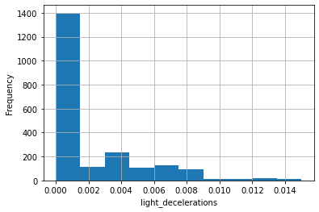
    


```python
df.iloc[:, 5].hist()
plt.xlabel("mean_value_of_short_term_variability")
plt.ylabel("Frequency")
plt.savefig("Figure_6.png")
plt.show()
```


    
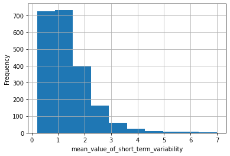
    


```python
df.iloc[:, 6].hist()
plt.xlabel("mean_value_of_long_term_variability")
plt.ylabel("Frequency")
plt.savefig("Figure_7.png")
plt.show()
```


    
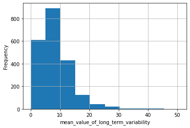
    


```python
df.iloc[:, 7].hist()
plt.xlabel("histogram_width")
plt.ylabel("Frequency")
plt.savefig("Figure_8.png")
plt.show()
```


    
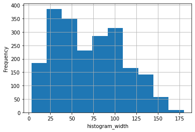
    


```python
df.iloc[:, 8].hist()
plt.xlabel("histogram_min")
plt.ylabel("Frequency")
plt.savefig("Figure_9.png")
plt.show()
```


    
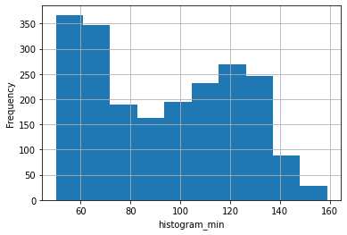
    


```python
df.iloc[:, 9].hist()
plt.xlabel("histogram_max")
plt.ylabel("Frequency")
plt.savefig("Figure_10.png")
plt.show()
```


    
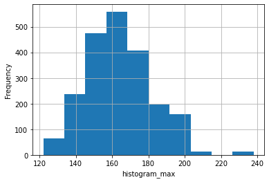
    


```python
df.iloc[:, 10].hist()
plt.xlabel("histogram_number_of_peaks")
plt.ylabel("Frequency")
plt.savefig("Figure_11.png")
plt.show()
```


    
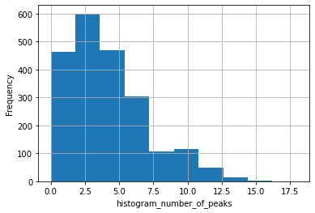
    


```python
df.iloc[:, 11].hist()
plt.xlabel("histogram_mode")
plt.ylabel("Frequency")
plt.savefig("Figure_12.png")
plt.show()
```


    

    


```python
df.iloc[:, 12].hist()
plt.xlabel("histogram_mean")
plt.ylabel("Frequency")
plt.savefig("Figure_13.png")
plt.show()
```


    
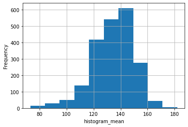
    


```python
df.iloc[:, 13].hist()
plt.xlabel("histogram_median")
plt.ylabel("Frequency")
plt.savefig("Figure_14.png")
plt.show()
```


    
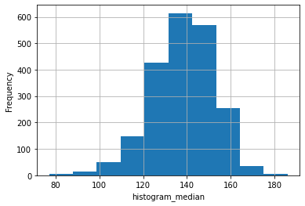
    


```python
df.iloc[:, 14].hist()
plt.xlabel("histogram_variance")
plt.ylabel("Frequency")
plt.savefig("Figure_15.png")
plt.show()
```


    
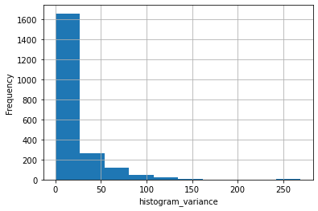
    


```python
import seaborn as sns
_fetal_health = [1.0, 2.0, 3.0]
fg = sns.FacetGrid(data=df, hue='fetal_health', hue_order=_fetal_health, aspect=1.61)
fg.map(plt.scatter, 'histogram_variance', 'fetal_movement').add_legend()
```


    <seaborn.axisgrid.FacetGrid at 0x7fce68a556d0>


    
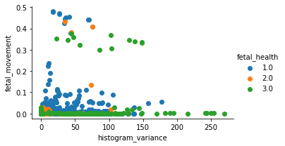
    

