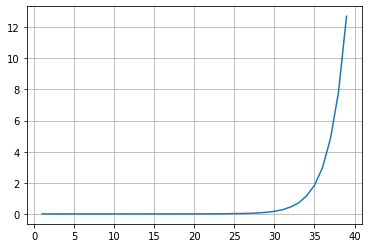
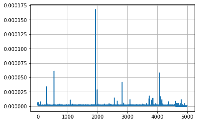

## Assignment 4

### Exercise 1

#### Implement a two-dimensional version of the gradient descent algorithm to find optimal choices of a and b. 


```python
import requests
h = 1e-4
gamma = 0.1
iterations = 100000
precision = 1e-5
```


```python
def request(a, b):
    return float(requests.get(f"http://ramcdougal.com/cgi-bin/error_function.py?a={a}&b={b}", headers={"User-Agent": "MyScript"}).text)
```


```python
def grad_descent(a, b):
    
    f = request(a, b)
    f_a = request(a + h, b)
    f_b = request(a, b + h)
    fprime_a = (f_a - f) / h
    fprime_b = (f_b - f) / h
    return [fprime_a, fprime_b]
```

#### Explain how you estimate the gradient given that you cannot directly compute the derivative, identify any numerical choices -- including but not limited to stopping criteria you made. Justify why you think they were reasonable choices

Since the derivative can not be calculated directly, I used the partial derivative method to estimate the derivatives. \
The formula I used is (f(a + h, b) - f(a, b))/h and (f(a, b + h) - f(a, b))/h. \
I set the precision level to 1e-5 which is neither too big nor too small for this algorithm to generate proper output. When the derivative is smaller than the precision level, the output converges to the local/global minimum point. \
I set the step size(gamma) as 0.1 since a and b are (0,1). 0.1 is a relatively proper learning rate. 

#### It so happens that this error function has a local minimum and a global minimum. Find both locations (i.e. a, b values) querying the API as needed and identify which corresponds to which. Briefly discuss how you would have tested for local vs global minima if you had not known how many minima there were. 

a = 0.4
b = 0.2
for i in range(iterations):
    grad_a, grad_b = grad_descent(a, b)
    if abs(grad_a) < precision and abs(grad_b) < precision:
        break
    a = a - grad_a * gamma
    b = b - grad_b * gamma 
print("stopping criteria point: ")
print("a =", a, "b =", b)
print("f =", request(a, b))


```python
a = 0.1
b = 0.1
for i in range(iterations):
    grad_a, grad_b = grad_descent(a, b)
    if abs(grad_a) < precision and abs(grad_b) < precision:
        break
    a = a - grad_a * gamma
    b = b - grad_b * gamma 
print("stopping criteria point: ")
print("a =", a, "b =", b)
print("f =", request(a, b))
```

    stopping criteria point: 
    a = 0.21594915000068263 b = 0.6889456899994538
    f = 1.10000000554


I first tried several tests. From the above tests, we can see that when a = 0.4 and b = 0.2, the minimum error point is when a = 0.7119491700005472 b = 0.16895009000019706, and f = 1.00000001522. When a = 0.1 and b =0.1, the minimum error point is when a = 0.21594915000068263 b = 0.6889456899994538, and f = 1.10000000554 \
It indicates the algorithm would generate at least two minimas. So I generate a 5$*$5 matrix with different a values and b values to see if there's any other minimas. 


```python
import tqdm
h = 1e-4
gamma = 0.1
iterations = 100000
precision = 1e-5
a_lst = [0.1, 0.3, 0.5, 0.7, 0.9]
b_lst = [0.1, 0.3, 0.5, 0.7, 0.9]
a_stop = []
b_stop = []
f_lst = []
for i in tqdm.tqdm(range(len(a_lst))):
    for j in range (len(b_lst)):
        a = a_lst[i]
        b = b_lst[j]
        for k in range(iterations):
            grad_a, grad_b = grad_descent(a, b)
            if abs(grad_a) < precision and abs(grad_b) < precision:
                break
            a = a - grad_a * gamma
            b = b - grad_b * gamma 
            
        a_stop.append(a)
        b_stop.append(b)
        f_lst.append(request(a,b))
```


```python
import csv

with open('output.csv', 'w') as f:
    write = csv.writer(f)
    write.writerow(a_stop)
    write.writerow(b_stop)
    write.writerow(f_lst)
```


```python
import csv
with open('output.csv', 'r') as f:
    csv_reader = csv.reader(f)
    data = list(csv_reader)
a_stop = data[0]
b_stop = data[1]
f_lst = data[2]
print(a_stop)
print(b_stop)
print(f_lst)
```

    ['0.21594915000068263', '0.21594867999953352', '0.21594741999831904', '0.2159459599999746', '0.21594741000098275', '0.2159506199999381', '0.21595097000063318', '0.21595188000093052', '0.21595458000070983', '0.2159518700004856', '0.7119485800002874', '0.7119485799996212', '0.21595406000068884', '0.2159540600004668', '0.21595405999957862', '0.7119497999999662', '0.7119499199999761', '0.7119499699995362', '0.21595442000096265', '0.21595441000007365', '0.7119512600001091', '0.711951270000332', '0.7119505100004911', '0.21595400000095', '0.2159539999989516']
    ['0.6889456899994538', '0.6889455599996872', '0.688945789998618', '0.6889503799992418', '0.6889547000013977', '0.6889456999992326', '0.6889455700005762', '0.6889457900006164', '0.6889506000012584', '0.6889547100005103', '0.16894954000036258', '0.16895087999982933', '0.6889473100002981', '0.6889501600005559', '0.6889530199994823', '0.16894883999963853', '0.16895088000049546', '0.16895089000007424', '0.6889501000001068', '0.6889519199993913', '0.1689495399999185', '0.1689508800007175', '0.16895089000029628', '0.6889500700005484', '0.688951239999335']
    ['1.10000000554', '1.1000000056', '1.1000000057', '1.10000000538', '1.10000000482', '1.10000000539', '1.10000000537', '1.10000000525', '1.1000000045', '1.10000000437', '1.00000001557', '1.00000001517', '1.10000000489', '1.10000000459', '1.10000000432', '1.00000001541', '1.00000001476', '1.00000001474', '1.10000000457', '1.10000000439', '1.00000001477', '1.00000001436', '1.00000001458', '1.10000000461', '1.10000000449']


From the output above, we can see that all the points converges to two minimas. I then wrote the below code to see wether there are more minimas.


```python
for i in range(len(a_stop)):
    if (abs(float(a_stop[i]) - 0.21595) <= 1e-5) and (abs(float(b_stop[i]) - 0.68895) <= 1e-5) and (abs(float(f_lst[i]) - 1.1000) <= 1e-5):
        print ('a = 0.21595 and b = 0.68895')
        print ('f = 1.100000')
        
    elif (abs(float(a_stop[i]) - 0.71195) <= 1e-5) and (abs(float(b_stop[i]) - 0.16895) <= 1e-5) and (abs(float(f_lst[i]) - 1.0000) <= 1e-5):
        print ('a = 0.71195 and b = 0.16895')
        print ('f = 1.000000')
        
    else:
        print ('Another Minimum exists')
```

    a = 0.21595 and b = 0.68895
    f = 1.100000
    a = 0.21595 and b = 0.68895
    f = 1.100000
    a = 0.21595 and b = 0.68895
    f = 1.100000
    a = 0.21595 and b = 0.68895
    f = 1.100000
    a = 0.21595 and b = 0.68895
    f = 1.100000
    a = 0.21595 and b = 0.68895
    f = 1.100000
    a = 0.21595 and b = 0.68895
    f = 1.100000
    a = 0.21595 and b = 0.68895
    f = 1.100000
    a = 0.21595 and b = 0.68895
    f = 1.100000
    a = 0.21595 and b = 0.68895
    f = 1.100000
    a = 0.71195 and b = 0.16895
    f = 1.000000
    a = 0.71195 and b = 0.16895
    f = 1.000000
    a = 0.21595 and b = 0.68895
    f = 1.100000
    a = 0.21595 and b = 0.68895
    f = 1.100000
    a = 0.21595 and b = 0.68895
    f = 1.100000
    a = 0.71195 and b = 0.16895
    f = 1.000000
    a = 0.71195 and b = 0.16895
    f = 1.000000
    a = 0.71195 and b = 0.16895
    f = 1.000000
    a = 0.21595 and b = 0.68895
    f = 1.100000
    a = 0.21595 and b = 0.68895
    f = 1.100000
    a = 0.71195 and b = 0.16895
    f = 1.000000
    a = 0.71195 and b = 0.16895
    f = 1.000000
    a = 0.71195 and b = 0.16895
    f = 1.000000
    a = 0.21595 and b = 0.68895
    f = 1.100000
    a = 0.21595 and b = 0.68895
    f = 1.100000


From the output we can see that, there are only two minimas. \
The local minimum is 1.1000 with a = 0.21595 and b = 0.68895 \
The global minimum is 1.0000 with a = 0.71195 and b = 0.16895

### Exercise 2

#### Modify the k-means code (or write your own) from slides8 to use the Haversine metric and work with our dataset. Visualize your results with a color-coded scatter plot; be sure to use an appropriate map projection (i.e. do not simply make x=longitude and y=latitude; Use this algorithm to cluster the cities data for k=5, 7, and 15. 


```python
!pip uninstall shapely -y
!pip install shapely --no-binary shapely
```


```python
!pip install cartopy
import cartopy
```


```python
# the haversine function to calculate the distance between one city and the ceter point 
# the center point is calculated by the k-means method
from math import radians, cos, sin, asin, sqrt

def haversine(lon1, lat1, lon2, lat2):
    """
    Calculate the great circle distance in kilometers between two points 
    on the earth (specified in decimal degrees)
    """
    # convert decimal degrees to radians 
    lon1, lat1, lon2, lat2 = map(radians, [lon1, lat1, lon2, lat2])

    # haversine formula 
    dlon = lon2 - lon1 
    dlat = lat2 - lat1 
    a = sin(dlat/2)**2 + cos(lat1) * cos(lat2) * sin(dlon/2)**2
    c = 2 * asin(sqrt(a)) 
    r = 6371 # Radius of earth in kilometers. Use 3956 for miles. Determines return value units.
    return c * r
```


```python
df = pd.read_csv('worldcities.csv')
```


```python
import pandas as pd
import plotnine as p9
import random
import numpy as np
import cartopy.crs as ccrs
import matplotlib.pyplot as plt


def k_means(df, k):
  pts = [np.array(pt) for pt in zip(df['lng'], df['lat'])]
  centers = random.sample(pts, k)
  old_cluster_ids, cluster_ids = None, [] 
  while cluster_ids != old_cluster_ids:
    old_cluster_ids = list(cluster_ids)
    cluster_ids = []
    for pt in pts:
      min_cluster = -1
      min_dist = float('inf')
      for i, center in enumerate(centers):
        dist = haversine(pt[0], pt[1], center[0], center[1])
        if dist < min_dist:
          min_cluster = i
          min_dist = dist
      cluster_ids.append(min_cluster)
    df['cluster'] = cluster_ids
    cluster_pts = [[pt for pt, cluster in zip(pts, cluster_ids) if cluster == match]
      for match in range(k)]
    centers = [sum(pts)/len(pts) for pts in cluster_pts]

  df = df[['lat','lng','cluster']]

  fig = plt.figure(figsize = (15,20))
  ax = fig.add_subplot(1, 1, 1, projection=ccrs.Robinson())

  for i in range(k):
      lats = df[df["cluster"] == i]["lat"].tolist()
      lngs = df[df["cluster"] == i]["lng"].tolist()
      ax.plot(lngs, lats, "o", markersize = 1, transform=ccrs.PlateCarree())

  ax.coastlines()
  ax.set_extent([-180, 180, -90, 90], crs=ccrs.PlateCarree())
  plt.show()
```

I wrote the k-means function above to calculate cluster using k-means method and plot the graph. The two parameters that the function take are the dataframe and the number of cluster k. \
I then tested the function with k = 5,7,15. I tested each k value three times to see the variation of plots.

For k = 5, the plots are shown below:

![k5_1.png]

![k5_2.png]

![k5_3.png]

For k = 7, the plots are shown below:


For k = 15, the plots are shown below:


#### Run it several times to get a sense of the variation of clusters for each k (share your plots); comment briefly on the diversity of results for each k. 

For each k = 5, k = 7, k = 15, I ran it three times and the plots shows different cluster results. That's because the center points of each clusters are generated randomly. 
Comparing the plots for those three values, when k is 15, the plots are more stable. And for k = 5 and k = 7, the shapes of plots highly depends on how the centers are generated each time.

### Excercise 3

#### In class, we discussed two different strategies for computing the Fibonacci sequence: directly with the recursive strategy, and recursive but modified using lru_cache. Implement both, time them with function of n


```python
def fibonacci(n):
    if n == 1 or n == 2:
        return 1
    if n > 2:
        return fibonacci(n-1) + fibonacci(n-2)
```


```python
from functools import lru_cache
@lru_cache()
def fib(n):
    if n == 1 or n == 2:
        return 1
    if n > 2:
        return fib(n-1) + fib(n-2)
```


```python
import time
from matplotlib import pyplot as plt
import numpy as np
import tqdm
```


```python
fibonacci_time = []
ns = range(1, 40)
for i in tqdm.tqdm(ns):
    start = time.time()
    fibonacci(i)
    stop = time.time()
    fibonacci_time.append(stop - start)
```

    100%|███████████████████████████████████████████| 39/39 [00:33<00:00,  1.17it/s]


```python
plt.plot(ns, fibonacci_time)
plt.grid()
```


    

    


```python
fib_time = []
ns_1 = range(1, 5000)
for i in tqdm.tqdm(ns_1):
    start = time.time()
    fib(i)
    stop = time.time()
    fib_time.append(stop - start)
```

    100%|███████████████████████████████████| 4999/4999 [00:00<00:00, 329359.04it/s]


```python
plt.plot(ns_1, fib_time)
plt.grid()
```


    

    


```python
fib.cache_info()
```


    CacheInfo(hits=19988, misses=9998, maxsize=128, currsize=128)


####  Discuss your choices (e.g. why those n and why you're displaying it that way; and your results 

I set n = 5000 for the lru fib method. When n is relatively small, all recursion will hit the cache, which makes the time very close to 0. However, when n becomes relatively large, some of the recursions will miss the cache and perform cache replacement. That's the reason of why some of the runtime for lru method is greater than zero using lru method. 

I set n from 1 to 40 for the naive recursive method since the runtime is too large when n is bigger. From the plot we can see that the runtime of this method increase sharply when n > 26. The reason behind it is that the runtime follows O(2^n)

After comparing this two method, we can see that the lru method is way better since it decreases the runtime significantly (the runtime is close to 0) even when n becomes relatively large. So I think the lru method is a better way.

### Exercise 4

#### Implement a function that takes two strings and returns an optimal local alignment and score


```python
import numpy as np
```


```python
def align(s1, s2, match=1, gap_penalty=1, mismatch_penalty=1):
    
    M = np.zeros([len(s1) + 1, len(s2) + 1], int)              
    route = {}
        
    for i in range(1, len(s1) + 1):
        for j in range(1, len(s2) + 1):
            
            # first calculate the score and generate the matrix 
            if s1[i - 1] == s2[j - 1]:
                # when match, add the score of match
                ul = M[i - 1, j - 1] + match 
            else:
                # when miss the match, minus the score of mismatch penalty
                ul = M[i - 1, j - 1] - mismatch_penalty 
            # there are two possibility to generate gaps:
            u = M[i - 1, j] - gap_penalty  # when theres insertion in the DNA sequence
            l = M[i, j - 1] - gap_penalty  # when theres deletion in the DNA sequence
            
            # get the score for each element in this matrix
            M[i, j] = max(ul, u, l, 0)
            
            # set the key of path as a list with the location of each element in M
            index = '[' + str(i) + ', ' + str(j) + ']'
            route[index] = []
            
            if ul == M[i, j]:
                route[index].append('[' + str(i - 1) + ', ' + str(j - 1) + ']')             
            if u == M[i, j]:
                route[index].append('[' + str(i - 1) + ', ' + str(j) + ']')
            if l == M[i, j]: 
                route[index].append('[' + str(i) + ', ' + str(j - 1) + ']')  
            
    max_index = np.argwhere(M == M.max()) 
    
    print("Matrix = ")
    print(M)
    # the score indicates the max value in the matrix 
    print("score = " + str(M.max()))
    
    for i in range(0, len(s1) + 1):
        route["[" + str(i) + ', 0]'] = []

    for i in range(0, len(s2) + 1):
        route['[0, ' + str(i) + "]"] = []
    
    #print(max_index)
    
    # set a for loop since there might be multiple M.max()
    for i in max_index: #traceback to find the route
        tb = route[str(list(i))]
        route_result = [str(list(i))]
      
        traceback(s1, s2, route, M, tb, route_result)
        #print(value)
        print(route_result)
    
```


```python
def traceback(s1,s2, route, M, tb, route_result):
    
    # append the value
    if tb != []:    
        i = (tb[0].split(',')[0])
        j = (tb[0].split(',')[1])
        i = int(i.strip('['))
        j = int(j.strip(']'))
        
        route_result.append(tb[0])
        tb = route[tb[0]]
    
    # recursively call function traceback when the value is not 0    
    if M[i, j] != 0:
        traceback(s1, s2, route, M, tb, route_result)
    else:
        right = 0
        down = 0
        seq1 = ''
        seq2 = ''
        for n in range(len(route_result)-2, -1, -1):
            location = route_result[n]
            
            i = (location.split(',')[0])
            j = (location.split(',')[1])
            i = int(i.strip('['))
            j = int(j.strip(']'))
        
            # deletion
            if j == down:
                seq1 += s1[i-1]
                seq2 += '-'
                
            # insertion
            elif i == right:
                seq1 += '-'
                seq2 += s2[j-1]
            
    
            # match
            else:
                seq1 += s1[i-1]
                seq2 += s2[j-1]
                
            right = i
            down = j     
            
        print(seq1)
        print(seq2)
```

#### Your function should also take and correctly use three keyword arguments with defaults as follows: match=1, gap_penalty=1, mismatch_penalty=1


```python
align('tgcatcgagaccctacgtgac', 'actagacctagcatcgac')
```

    Matrix = 
    [[0 0 0 0 0 0 0 0 0 0 0 0 0 0 0 0 0 0 0]
     [0 0 0 1 0 0 0 0 0 1 0 0 0 0 1 0 0 0 0]
     [0 0 0 0 0 1 0 0 0 0 0 1 0 0 0 0 1 0 0]
     [0 0 1 0 0 0 0 1 1 0 0 0 2 1 0 1 0 0 1]
     [0 1 0 0 1 0 1 0 0 0 1 0 1 3 2 1 0 1 0]
     [0 0 0 1 0 0 0 0 0 1 0 0 0 2 4 3 2 1 0]
     [0 0 1 0 0 0 0 1 1 0 0 0 1 1 3 5 4 3 2]
     [0 0 0 0 0 1 0 0 0 0 0 1 0 0 2 4 6 5 4]
     [0 1 0 0 1 0 2 1 0 0 1 0 0 1 1 3 5 7 6]
     [0 0 0 0 0 2 1 1 0 0 0 2 1 0 0 2 4 6 6]
     [0 1 0 0 1 1 3 2 1 0 1 1 1 2 1 1 3 5 5]
     [0 0 2 1 0 0 2 4 3 2 1 0 2 1 1 2 2 4 6]
     [0 0 1 1 0 0 1 3 5 4 3 2 1 1 0 2 1 3 5]
     [0 0 1 0 0 0 0 2 4 4 3 2 3 2 1 1 1 2 4]
     [0 0 0 2 1 0 0 1 3 5 4 3 2 2 3 2 1 1 3]
     [0 1 0 1 3 2 1 0 2 4 6 5 4 3 2 2 1 2 2]
     [0 0 2 1 2 2 1 2 1 3 5 5 6 5 4 3 2 1 3]
     [0 0 1 1 1 3 2 1 1 2 4 6 5 5 4 3 4 3 2]
     [0 0 0 2 1 2 2 1 0 2 3 5 5 4 6 5 4 3 2]
     [0 0 0 1 1 2 1 1 0 1 2 4 4 4 5 5 6 5 4]
     [0 1 0 0 2 1 3 2 1 0 2 3 3 5 4 4 5 7 6]
     [0 0 2 1 1 1 2 4 3 2 1 2 4 4 4 5 4 6 8]]
    score = 8
    agacccta-cgt-gac
    aga-cctagcatcgac
    ['[21, 18]', '[20, 17]', '[19, 16]', '[18, 15]', '[18, 14]', '[17, 13]', '[16, 12]', '[15, 11]', '[15, 10]', '[14, 9]', '[13, 8]', '[12, 7]', '[11, 6]', '[10, 6]', '[9, 5]', '[8, 4]', '[7, 3]']


```python
align('tgcatcgagaccctacgtgac', 'actagacctagcatcgac', gap_penalty=2)
```

    Matrix = 
    [[0 0 0 0 0 0 0 0 0 0 0 0 0 0 0 0 0 0 0]
     [0 0 0 1 0 0 0 0 0 1 0 0 0 0 1 0 0 0 0]
     [0 0 0 0 0 1 0 0 0 0 0 1 0 0 0 0 1 0 0]
     [0 0 1 0 0 0 0 1 1 0 0 0 2 0 0 1 0 0 1]
     [0 1 0 0 1 0 1 0 0 0 1 0 0 3 1 0 0 1 0]
     [0 0 0 1 0 0 0 0 0 1 0 0 0 1 4 2 0 0 0]
     [0 0 1 0 0 0 0 1 1 0 0 0 1 0 2 5 3 1 1]
     [0 0 0 0 0 1 0 0 0 0 0 1 0 0 0 3 6 4 2]
     [0 1 0 0 1 0 2 0 0 0 1 0 0 1 0 1 4 7 5]
     [0 0 0 0 0 2 0 1 0 0 0 2 0 0 0 0 2 5 6]
     [0 1 0 0 1 0 3 1 0 0 1 0 1 1 0 0 0 3 4]
     [0 0 2 0 0 0 1 4 2 0 0 0 1 0 0 1 0 1 4]
     [0 0 1 1 0 0 0 2 5 3 1 0 1 0 0 1 0 0 2]
     [0 0 1 0 0 0 0 1 3 4 2 0 1 0 0 1 0 0 1]
     [0 0 0 2 0 0 0 0 1 4 3 1 0 0 1 0 0 0 0]
     [0 1 0 0 3 1 1 0 0 2 5 3 1 1 0 0 0 1 0]
     [0 0 2 0 1 2 0 2 1 0 3 4 4 2 0 1 0 0 2]
     [0 0 0 1 0 2 1 0 1 0 1 4 3 3 1 0 2 0 0]
     [0 0 0 1 0 0 1 0 0 2 0 2 3 2 4 2 0 1 0]
     [0 0 0 0 0 1 0 0 0 0 1 1 1 2 2 3 3 1 0]
     [0 1 0 0 1 0 2 0 0 0 1 0 0 2 1 1 2 4 2]
     [0 0 2 0 0 0 0 3 1 0 0 0 1 0 1 2 0 2 5]]
    score = 7
    gcatcga
    gcatcga
    ['[8, 17]', '[7, 16]', '[6, 15]', '[5, 14]', '[4, 13]', '[3, 12]', '[2, 11]', '[1, 10]']


```python
# try the function with different values of match, gap_penalty, and mismatch_penalty
align('tgcatcgagaccctacgtgac', 'actagacctagcatcgac', match = 3, gap_penalty=2, mismatch_penalty = 1)
```

    Matrix = 
    [[ 0  0  0  0  0  0  0  0  0  0  0  0  0  0  0  0  0  0  0]
     [ 0  0  0  3  1  0  0  0  0  3  1  0  0  0  3  1  0  0  0]
     [ 0  0  0  1  2  4  2  0  0  1  2  4  2  0  1  2  4  2  0]
     [ 0  0  3  1  0  2  3  5  3  1  0  2  7  5  3  4  2  3  5]
     [ 0  3  1  2  4  2  5  3  4  2  4  2  5 10  8  6  4  5  3]
     [ 0  1  2  4  2  3  3  4  2  7  5  3  3  8 13 11  9  7  5]
     [ 0  0  4  2  3  1  2  6  7  5  6  4  6  6 11 16 14 12 10]
     [ 0  0  2  3  1  6  4  4  5  6  4  9  7  5  9 14 19 17 15]
     [ 0  3  1  1  6  4  9  7  5  4  9  7  8 10  8 12 17 22 20]
     [ 0  1  2  0  4  9  7  8  6  4  7 12 10  8  9 10 15 20 21]
     [ 0  3  1  1  3  7 12 10  8  6  7 10 11 13 11  9 13 18 19]
     [ 0  1  6  4  2  5 10 15 13 11  9  8 13 11 12 14 12 16 21]
     [ 0  0  4  5  3  3  8 13 18 16 14 12 11 12 10 15 13 14 19]
     [ 0  0  3  3  4  2  6 11 16 17 15 13 15 13 11 13 14 12 17]
     [ 0  0  1  6  4  3  4  9 14 19 17 15 13 14 16 14 12 13 15]
     [ 0  3  1  4  9  7  6  7 12 17 22 20 18 16 14 15 13 15 13]
     [ 0  1  6  4  7  8  6  9 10 15 20 21 23 21 19 17 15 13 18]
     [ 0  0  4  5  5 10  8  7  8 13 18 23 21 22 20 18 20 18 16]
     [ 0  0  2  7  5  8  9  7  6 11 16 21 22 20 25 23 21 19 17]
     [ 0  0  0  5  6  8  7  8  6  9 14 19 20 21 23 24 26 24 22]
     [ 0  3  1  3  8  6 11  9  7  7 12 17 18 23 21 22 24 29 27]
     [ 0  1  6  4  6  7  9 14 12 10 10 15 20 21 22 24 22 27 32]]
    score = 32
    atcgagacccta-cgt-gac
    a-ctaga-cctagcatcgac
    ['[21, 18]', '[20, 17]', '[19, 16]', '[18, 15]', '[18, 14]', '[17, 13]', '[16, 12]', '[15, 11]', '[15, 10]', '[14, 9]', '[13, 8]', '[12, 7]', '[11, 6]', '[10, 6]', '[9, 5]', '[8, 4]', '[7, 3]', '[6, 2]', '[5, 1]', '[4, 1]', '[3, 0]']


Then, I tried the example from Wikipedia, the input strings are "TGTTACGG" and "GGTTGACTA"


```python
align("tgttacgg", 'ggttgacta', match = 3, gap_penalty=2)
```

    Matrix = 
    [[ 0  0  0  0  0  0  0  0  0  0]
     [ 0  0  0  3  3  1  0  0  3  1]
     [ 0  3  3  1  2  6  4  2  1  2]
     [ 0  1  2  6  4  4  5  3  5  3]
     [ 0  0  0  5  9  7  5  4  6  4]
     [ 0  0  0  3  7  8 10  8  6  9]
     [ 0  0  0  1  5  6  8 13 11  9]
     [ 0  3  3  1  3  8  6 11 12 10]
     [ 0  3  6  4  2  6  7  9 10 11]]
    score = 13
    gtt-ac
    gttgac
    ['[6, 7]', '[5, 6]', '[4, 5]', '[4, 4]', '[3, 3]', '[2, 2]', '[1, 1]']


#### Test it, and explain how your tests show that your function works. Be sure to test other values of match, gap_penalty, and mismatch_penalty

I first generated a matrix M with the score of each index calculated by the maximum value of (match, gap_penalty, and mismatch_penalty). 
The score is the maximum value of this matrix.
I then get the index(location) of the maximum score and set this location as the intitial traceback index. I used a dictionary to keep track of the route of traceback. Insert "-" relatively in seq1 and seq2 when there's gaps.

From the first three tests, we can see that although the input DNA sequences are the same, giving diffrent values of match, gap_penalty, and mistmatch_penalty will yield different output sequences. That's because different score will yield different maximum values and different traceback routes, which further leads to different output sequences.
