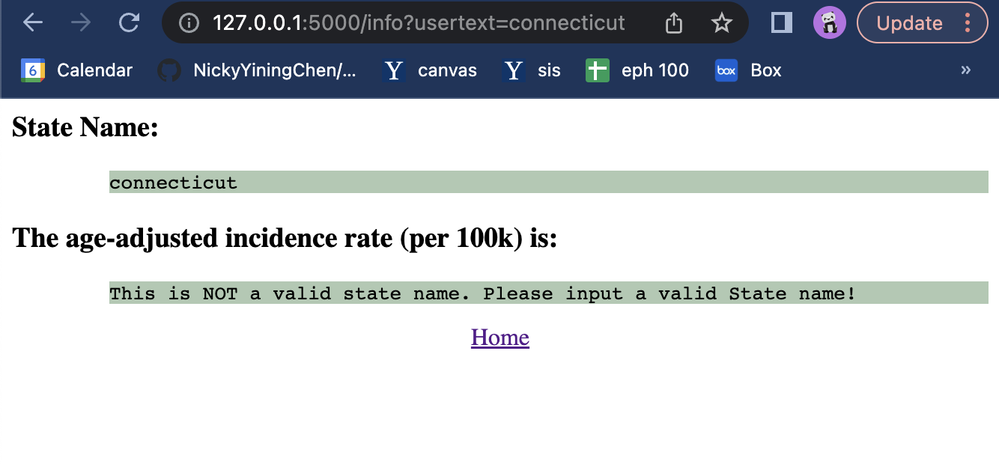
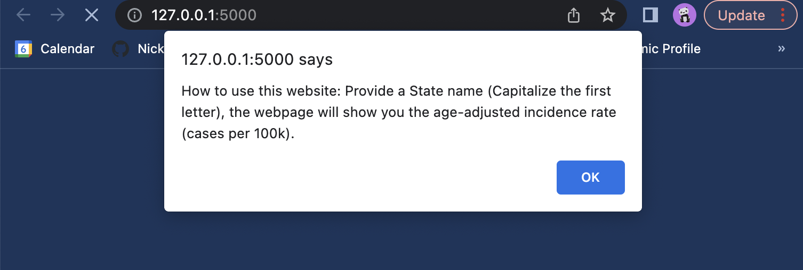

## Assignment 5

### Excercise 1

**Implement a two-dimensional k-nearest neighbors classifier (in particular, do not use sklearn for k-nearest neighbors here): given a list of (x, y; class) data, store this data in a quad-tree.**

I referenced  https://github.com/diana12333/QuadtreeNN/blob/anewbranch/quadtree.py when trying to implement the knn analysis. 

 The code is shown below:

```python
from sklearn import decomposition
from sklearn.metrics import confusion_matrix
from collections import Counter
import heapq
import numpy as np
import math

class Node():
    def __init__(self, isleaf, xlo, xhi, ylo, yhi, xmid = None, ymid = None, x = None, y = None, classifier = None, ul = None, ur = None, ll = None, lr = None, _parent = None):
        self.nodecount = 0 
        self.isleaf = isleaf 
        self.x = x
        self.y = y 
        self.classifier = classifier 
 
        self.xlo = xlo
        self.xmid = xmid # median     
        self.xhi = xhi
        self.ylo = ylo
        self.ymid = ymid # median      
        self.yhi = yhi
       
        self.ul = ul
        self.ur = ur
        self.ll = ll
        self.lr = lr
        self._parent = _parent
        
class QdTree():
    def __init__(self, xlo, xhi, ylo, yhi):
        self.root = Node(True, xlo, xhi, ylo, yhi)

    def insert_node(self, node, data):
        if len(data)==0:
            return

        elif len(data)==1:
            node.nodecount = 1
            node.isleaf = True
            node.x = data["pc0"].iloc[0]
            node.y = data["pc1"].iloc[0]
            node.classifier=data["type_rice"].iloc[0]
        
        else:
            node.isleaf = False
            node.nodecount = len(data) 
            
            node.xmid = np.median(data["pc0"])
            node.ymid = np.median(data["pc1"])

            ul_data = data[(data["pc0"] < node.xmid) & (data["pc1"] >= node.ymid)]        
            ur_data = data[(data["pc0"] >= node.xmid) & (data["pc1"]>=node.ymid)]
            ll_data = data[(data["pc0"]<node.xmid) & (data["pc1"]<node.ymid)]
            lr_data = data[(data["pc0"]>=node.xmid) & (data["pc1"]<node.ymid)]
        
            node.ul = Node(1,node.xlo,node.xmid,node.ymid,node.yhi,_parent=node)
            self.insert_node(node.ul,ul_data)          
            node.ur = Node(1,node.xmid,node.xhi,node.ymid,node.yhi,_parent=node)
            self.insert_node(node.ur,ur_data)                                
            node.ll = Node(1,node.xlo,node.xmid,node.ylo,node.ymid,_parent=node)            
            self.insert_node(node.ll,ll_data)
            node.lr = Node(1,node.xmid,node.xhi,node.ylo,node.ymid,_parent=node) 
            self.insert_node(node.lr, lr_data)
            
            if not node.ur.nodecount:
                node.ur = None
            if not node.ul.nodecount:
                node.ul = None 
            if not node.ll.nodecount:
                node.ll = None 
            if not node.lr.nodecount:
                node.lr = None 

    def search_node(self, x, y, count = 1):
        root = self.root
        parent = None
        while root and not root.isleaf:
            if root.nodecount <= count:
                return root

            if x < root.xmid and y < root.ymid:
                parent = root
                root = root.ll

            elif x < root.xmid and y >= root.ymid:
                parent = root
                root = root.ul

            elif x >= root.xmid and y < root.ymid:
                parent = root
                root = root.lr

            else:
                parent = root
                root = root.ur

        return root if root else parent
    
    def euclidean_distance(self, x, y):
        dist = (x[0] - y[0]) ** 2 + (x[1] - y[1]) ** 2
        return math.sqrt(dist)

    def _within_distance(self, x, y,node,d):
        if x<node.xlo and y<node.ylo:
            return self.euclidean_distance([x,y], [node.xlo,node.ylo])<=d
        elif x<node.xlo and y<node.yhi:
            return self.euclidean_distance([x,y],[node.xlo,y])<=d
        elif x<node.xlo and y>=node.yhi:
            return self.euclidean_distance([x,y],[node.xlo,node.yhi])<=d
        elif x<node.xhi and y<node.ylo:
            return self.euclidean_distance([x,y],[x,node.ylo])<=d
        elif x<node.xhi and y<node.yhi:
            return True
        elif x<node.xhi and y>=node.yhi:
            return self.euclidean_distance([x,y],[x,node.yhi])<=d          
        elif x>=node.xhi and y<node.ylo:
            return self.euclidean_distance([x,y],[node.xhi,node.ylo])<=d
        elif x>=node.xhi and y<node.yhi:
            return self.euclidean_distance([x,y],[node.xhi,node.yhi])<=d
        elif x>=node.xhi and y>=node.yhi:
            return self.euclidean_distance([x,y],[node.xhi,node.yhi])<=d

    def knn(self, x, y, k):
        neighbors = []
        lst = [self.search_node(x,y,count=k)]
        while lst:
            item=lst.pop(0) 
            if item.isleaf:
                euclidean_distance = self.euclidean_distance([item.x, item.y], [x,y])
                heapq.heappush(neighbors,(-euclidean_distance, item))
            else:
                for child in [item.ll,item.lr,item.ul,item.ur]:
                    if child:
                        lst.append(child)                  
        lst=[self.root]
        while lst:
            item=lst.pop(0)
            if item.isleaf:
                euclidean_distance=self.euclidean_distance([item.x, item.y],[x,y])
                heapq.heappush(neighbors,(-euclidean_distance, item))
                if len(neighbors) > k:
                    heapq.heappop(neighbors)
            else:
                for child in [item.ll,item.lr,item.ul,item.ur]: 
                    if child and child != (self.search_node(x,y,count=k)):
                        if len(neighbors)<k or self._within_distance(x,y,child,-neighbors[0][0]):
                            lst.append(child)
        return neighbors
```

**Using a reasonable train-test split with your k-nearest neighbors implementation, Normalize the seven quantitative columns to a mean of 0 and standard deviation 1.**

 ```python
 import pandas as pd
 data_1 = pd.read_excel('Rice_Cammeo_Osmancik.xlsx')
 quant_cols_1 = data_1.drop('Class', axis=1)
 type_rice_1 = data_1['Class']
 
 import numpy as np
 from sklearn.model_selection import train_test_split
 x_cols = data_1.columns[:(len(data_1.columns)-1)]
 x_train, x_test, y_train, y_test = train_test_split(quant_cols_1, type_rice_1, test_size=0.2)
 
 x_train.iloc[:,0:-1] = x_train.iloc[:,0:-1].apply(lambda x: (x-x.mean())/ x.std(), axis=0)
 x_test.iloc[:,0:-1] = x_test.iloc[:,0:-1].apply(lambda x: (x-x.mean())/ x.std(), axis=0)
 
 from sklearn import decomposition
 # trained points
 pca = decomposition.PCA(n_components=2)
 test_reduced = pca.fit_transform(x_train[x_cols])
 pc0_trained = test_reduced[:, 0]
 pc1_trained = test_reduced[:, 1]
 
 # test points
 test_data_reduced = pca.transform(x_test[x_cols])
 pc0_test = test_data_reduced[:, 0]
 pc1_test = test_data_reduced[:, 1]
 
 pca_train = pd.DataFrame({'pc0':pc0_trained, 'pc1':pc1_trained,'type_rice': y_train}) 
 pca_train.to_csv('pca_train.csv') 
 pca_train = pd.read_csv('pca_train.csv')
 pc0 = pca_train["pc0"]
 pc1 = pca_train["pc1"]
 type_rice = pca_train['type_rice']
 c_0 = []
 c_1 = []
 o_0 = []
 o_1 = []
 
 for i in range (len(type_rice)):
     if type_rice[i] == 'Cammeo':
         c_0.append(pc0[i])
         c_1.append(pc1[i])
     if type_rice[i] == 'Osmancik':
         o_0.append(pc0[i])
         o_1.append(pc1[i])
 
 pca_test = pd.DataFrame({'pc0':pc0_test, 'pc1':pc1_test,'type_rice': y_test})  
 pc0_test = pca_test["pc0"]
 pc1_test = pca_test["pc1"]
 type_rice_test = pca_test['type_rice']
 ```

**Plot this on a scatterplot, color-coding by type of rice.**

```python
from matplotlib import pyplot as plt

plt.figure(figsize=(12,7))
plt.scatter(c_0, c_1, label = 'Cammeo', s = 10)
plt.scatter(o_0, o_1, label = 'Osmancik', s = 10)
plt.xlabel("pc0")
plt.ylabel("pc1")
plt.legend()
plt.title("Scatter Plot for Trained Points")
plt.show()
```

The graph is shown below:


**Comment on what the graph suggests about the effeciveness of using k-nearest neighbors on this 2-dimensional reduction of the data to predict the type of rice.** 

The pca graph suggests that using pca, there's a clear seperation between two types of rices, Cammeo and Osmancik. However, as we can see, when pc0 is within the range of (-0.5, 1), there exists a clear overlap. It might make it hard (not as accurate) to classify the rice type of  test points. So using k-nearest neighbors may significantly increase the accuracy.

**Using a reasonable train-test split with your k-nearest neighbors implementation, give the confusion matrix for predicting the type of rice with k=1. Repeat for k=5.**

```python
datatree = QdTree(min(pca_train["pc0"]),max(pca_train["pc0"]),min(pca_train["pc1"]),max(pca_train["pc1"]))
datatree.insert_node(datatree.root,pca_train)

result = []
true_prediction = []

for index, data in pca_test.iterrows():
    _tree = datatree.knn(data["pc0"], data["pc1"], 1)
    count = []
    for item in _tree:
        count.append(item[1].classifier)
    qdtree = Counter(count).most_common(1)[0][0]  
    result.append(qdtree)
true_prediction += pca_test['type_rice'].to_list()

print("The confusion matrix of k = 1")
print(confusion_matrix(result,true_prediction))
```

```python
result = []
true_prediction = []

for index,data in pca_test.iterrows():
    _tree = datatree.knn(data["pc0"],data["pc1"], 5)
    count = []
    for item in _tree:
        count.append(item[1].classifier)
    qdtree = Counter(count_list).most_common(1)[0][0]  
    result.append(qdtree)
true_prediction += pca_test['type_rice'].to_list()

print("The confusion matrix of k = 5")
print(confusion_matrix(result,true_prediction))
```

Output:


**Provide a brief interpretation of what the confusion matrix results mean.** 

When k = 1, there are 273 Cammeo rice correctly labeled as Cammeo using knn analysis. And there are 48 Cammeo rice incorrectly labeled as Osmancik using knn analysis. There are 42 Osmancik rice incorrectly labeled as Cammeo, and there are 398 Osmancik rice correctly labeled as Osmancik.

When k = 5, there are 284 Cammeo rice correctly labeled as Cammeo using knn analysis. And there are 35 Cammeo rice incorrectly labeled as Osmancik using knn analysis. There are 32 Osmancik rice incorrectly labeled as Cammeo, and there are 411 Osmancik rice correctly labeled as Osmancik.

In comparison, we can see that as k increased from 1 to 5, the prediction accuracy of knn slightly increased.

**Given a new (x, y) point and a value of k (the number of nearest neighbors to examine), it should be able to identify the most common class within those k nearest neighbors** 

```python
result = []
_tree = datatree.knn(x = 0.123, y = 0.456, k=1)
count = []
for item in _tree:
    count.append(item[1].classifier)
qdtree = Counter(count).most_common(1)[0][0]  
result.append(qdtree)
print(result)
```

Output:


### Excercise 2

**Describe your plan for your final project. What's your data?**

The data I want to use is the fetal health data on Kaggle. Everyone is able to access and download it from this link: https://www.kaggle.com/datasets/andrewmvd/fetal-health-classification

As for the original dataset, there are 22 variables:

-baseline value: The baseline fetal heart rate
-accelerations: Number of accelerations per second
-fetal_movement: Number of fetal movements per second
-uterine_contractions: Number of uterine contractions per second
-light_decelerations: Number of LDs per second
-severe_decelerations: Number of SDs per second 
-prolongued_decelerations: Number of PDs per second
-abnormal_short_term_variability: Percentage of time with abnormal short term variability
-mean_value_of_short_term_variability: Mean value of short term variability
-percentage_of_time_with_abnormal_long_term_variability: Percentage of time with abnormal long term variability
-mean_value_of_long_term_variability: Mean value of long term variability
-histogram_width- Width of FHR histogram 
-histogram_min- Minimum (low frequency) of FHR histogram
-histogram_max'- Maximum (high frequency) of FHR histogram 
-histogram_number_of_peaks'- Number of histogram peaks 
-histogram_number_of_zeroes'- Number of histogram zeros 
-histogram_mode'- Histogram mode 
-histogram_mean'- Histogram mean 
-histogram_median'- Histogram median 
-histogram_variance'- Histogram variance 
-histogram_tendency'- Histogram tendency 
-fetal_health: Fetal health: 1 - Normal 2 - Suspect 3 - Pathological

Among all the 22 variables, I deleted seven of them due to the problem of missing data and data correlation. So the final dataset im going to use contains 15 variables, which are: baseline value, accelerations, fetal_movement, uterine_contraction, light_decelerations, mean_value_of_short_term_variability, mean_value_of_long_term_variability, histogram_width, histogram_min, histogram_max, histogram_number_of_peaks, histogram_mode, histogram_mean, histogram_median, histogram_variance, and fetal_health

 **What analyses do you want to run and why are they interesting?**

I want to use multiple methods/analysis to see whether there's any relationship between the fetal health and other variables and develop models to classifify/predict fetal health status using other variables. The output may futher used to prevent child and maternal mortality. The analysis i would like to make is a logistic regression, a pca test, a random forrest, and a k nearest neighbor analysis.
First i want to do some data visualization, following with a logistic regression to see if any of the variables are significantly predictors. Then, i want to use the significant predictors i found to do pca analysis to get a scatter plot to visualize the distribution of using the classifier fetal_health. After that, I am going to split the data as two groups: test_points and train_points, then perform knn analysis and random forrest analysis to see the accuracy of predicting test_points' fetal_health condition. 

**Which ones will be interactive, where the user can provide a parameter? (4 points; there must be at least one). What graphs will you make?**

I would like to set the value of k neighbors in knn analysis as a UI parameter. By inputing different k value, the user would be able to get different prediction results with different accuracy. 
Graphs that i want to make contains a figure of several descriptive analysis . Then i want to make graphs such as histograms and scatter plots to visualize the variables. As for pca tests, I'm planning to generate a scatter plot to see the distribution for different fetal_health conditions. I may include graphs of confusion tests, accuracy analysis, and comparations.  

**Describe how you want your website to work.**

I'm going to use flask to build the server. And i'm going to make css/js files to make the webpage looks prettier.

**What do you see as your biggest challenge to completing this, and how do you expect to overcome this challenge?**   

The biggest challenge to complete this project is that the significant predictors may not be a lot (if choosing p<0.05, the significant variables are too few). I'm expecting to decrease the CI and set p value as 0.1. In this way, I could get a relatively reasonable number variables to make predictions.

### Excercise 3

**Perform any necessary data cleaning. Include the cleaned CSV file in your homework submission, and make sure your readme includes a citation of where the original data came from and how you changed the csv file.**

I downloaded the csv file "incd.csv" from https://statecancerprofiles.cancer.gov/incidencerates/index.php. This file credits to National Cancer Institute.

As for data cleaning, I first deleted the first 8 rows of the orginal file since it is just some labels and does not provide much useful information.  After that, I deleted the the last 32 rows of the original file since it's just some explanation and references of the dataset. 

Looking through the original dataset, we can see that for "Nevada", there are several columns (including the main ouput rate column) with value of *data not available*. To deal with missing data, I delete the Nevada row since the missing value is the main output that we want.

I also got rid of the number and parenthesis in state columns. For example, I changed "Connecticut(7)" to "Connecticut". The final version of cleaned data is call "incd_cleaned.csv" and it's included in the folder. 

**Using Flask, implement a server that provides three routes**

The python file I wrote is "app.py". The code is shown below:

``` python
from flask import Flask, render_template, request
import pandas as pd

df = pd.read_csv("incd_cleaned.csv")

state_list = df["State"].to_list()
rate_list = df["Age-Adjusted Incidence Rate([rate note]) - cases per 100,000"].to_list()

app = Flask(__name__)

@app.route("/")
def index():
    return render_template("index.html")


@app.route("/info", methods=["GET"])
def analyze():
    usertext = request.args.get("usertext")
    if usertext in state_list[1:]:
        i = state_list.index(usertext)
        rate = str(rate_list[i])
    else:
        rate = "This is NOT a valid state name. Please input a valid State name!"
    return render_template("analyze.html", output = rate, usertext=usertext)

@app.route("/state/<string:name>")
def state(name):
    i = state_list.index(name)
    rate = rate_list[i]
    state = "The State name is: <u>" + name + "</u>. It has an age-adjusted incidence rate (per 100k) of <u>" + str(rate) + "</u>"
    return state
    

if __name__ == "__main__":
    app.run(debug=True)

```

I also made two html files, which are "index.html" and "analyze.html". They are stored in the <u>templates</u> folder. The code are shown below: (the first one is index.html, the second one is analyze.html)

```html
<html>
    
    <head>
        <meta charset="UTF-8">
        <title>index</title>
        <script src="{{ url_for('static', filename='js/usage.js')}}"></script>
    </head>
    <body>
        <center>
        <h1>
            US Cancer Age-adjusted Incidence Rate 
        </h1>
        
        Hello everybody. <br><br>
        

        To get the mean and standard deviation of age-adjusted incidence rate, type in the url: http://127.0.0.1:5000/moreinfo <br> 
        Another method to get the age-adjusted incidence rate is to type in the url with state name. Example: http://127.0.0.1:5000/State/Oklahoma <br><br><br>
        <b>Input a State to get its age-adjusted incidence rate: (Capitalize the first letter)<b><br><br>
        </center>
        <form action="/info" method="GET">
            <textarea style="width:100%; height: 5em" name="usertext"></textarea>
            <br>
            <br>
            <center>
            <input type="submit" value="Submit">
            </center>
        </form>
    </body>
</html>
```

```html
<html>
    <body>
        <h3>
        State Name:
        </h3>
        <pre style="background-color: rgb(175, 201, 178); margin-left: 5em">{{ usertext }}</pre>
        <h3>
        The age-adjusted incidence rate (per 100k) is:
        </h3>
        <pre style="background-color: rgb(175, 201, 178); margin-left: 5em">{{ output }}</pre>
        <center>
        <a href="http://127.0.0.1:5000/" target="_self">Home</a>
        </center>
    </body>
</html>
```

The first route is shown as below: 


To use the API method, type the State name after "http://127.0.0.1:5000/state/" to get the age-adjusted incident rate. For example, to get the age-adjusted incident rate for Okahoma state, type "http://127.0.0.1:5000/state/Oklahoma", and the webpage is shown like following:


To use the get method, type the state name in the text box(needs to capitalize the first letter). The page will direct to the analyze page as below:


As for an invalid state name, it needs to be spelled correctly. The first letter of the state name needs to be capitalized and all the other letters need to be in lowercase. If the input state is invalid,  the webpage will be shown like below:



**Take this exercise one step beyond that which is described above in a way that you think is appropriate, and discuss your extension in your readme.**

As for my level up, I included a js file called “usage.js” which is included in the static folder. I use this file to add an alert message about the main purpose of this webpage. The js file is shown below:

``` js
alert("How to use this website: Provide a State name (Capitalize the first letter), the webpage will show you the age-adjusted incidence rate (cases per 100k).")
```

The pop-up window looks like below:



I also include another route which shows the average number and standard deviation of the age-adjusted incident rate among all the states in the United States. To access this webpage, type http://127.0.0.1:5000/moreinfo in the url. The function is shown below:

```python
rate_average = df["Age-Adjusted Incidence Rate([rate note]) - cases per 100,000"].mean()
rate_average = round(rate_average, 2)
rate_std = df["Age-Adjusted Incidence Rate([rate note]) - cases per 100,000"].std()
rate_std = round(rate_std, 2)

@app.route("/moreinfo")
def mean_std():
    info = "<center> In the United States, the average of age-adjusted incidence rate is: <b> <br>" + str(rate_average) + "</b> <br>The standard deviation is: <b><br>" + str(rate_std) + "</b> </center>"
    return info
```

The page is shown below:


