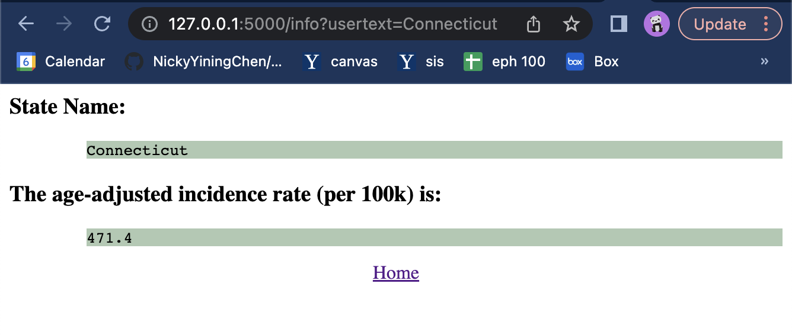
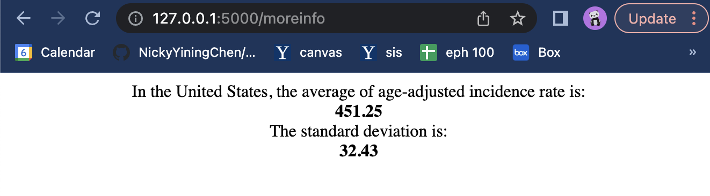

## Assignment 5

### Excercise 1

### Excercise 2

### Excercise 3

**Perform any necessary data cleaning. Include the cleaned CSV file in your homework submission, and make sure your readme includes a citation of where the original data came from and how you changed the csv file.**

I downloaded the csv file "incd.csv" from https://statecancerprofiles.cancer.gov/incidencerates/index.php. This file credits to National Cancer Institute.

As for data cleaning, I first deleted the first 8 rows of the orginal file since it is just some labels and does not provide much useful information.  After that, I deleted the the last 32 rows of the original file since it's just some explanation and references of the dataset. 

Looking through the original dataset, we can see that for "Nevada", there are several columns (including the main ouput rate column) with value of *data not available*. To deal with missing data, I delete the Nevada row since the missing value is the main output that we want.

I also got rid of the number and parenthesis in state columns. For example, I changed "Connecticut(7)" to "Connecticut". The final version of cleaned data is call "incd_cleaned.csv" and it's included in the folder. 

**Using Flask, implement a server that provides three routes**

The python file I wrote is "app.py". The code is shown below:

``` python
from flask import Flask, render_template, request
import pandas as pd

df = pd.read_csv("incd_cleaned.csv")

state_list = df["State"].to_list()
rate_list = df["Age-Adjusted Incidence Rate([rate note]) - cases per 100,000"].to_list()

app = Flask(__name__)

@app.route("/")
def index():
    return render_template("index.html")

@app.route("/info", methods=["GET"])
def analyze():
    usertext = request.args.get("usertext")
    if usertext in state_list[1:]:
        i = state_list.index(usertext)
        rate = str(rate_list[i])
    else:
        rate = "Please input a valid State name!"
    return render_template("analyze.html", output = rate, usertext=usertext)

@app.route("/state/<string:name>")
def state(name):
    i = state_list.index(name)
    rate = rate_list[i]
    state = "The State name is: <u>" + name + "</u>. It has an age-adjusted incidence rate (per 100k) of <u>" + str(rate) + "</u>"
    return state
    
if __name__ == "__main__":
    app.run(debug=True)

```

I also made two html files, which are "index.html" and "analyze.html". They are stored in the <u>templates</u> folder. The code are shown below: (the first one is index.html, the second one is analyze.html)

```html
<html>
    <head>
        <meta charset="UTF-8">
        <title>index</title>
        <script src="{{ url_for('static', filename='js/usage.js')}}"></script>
    </head>
    <body>
        Hello everybody. <br><br>
        To get the mean and standard deviation of age-adjusted incidence rate, type in the url: http://127.0.0.1:5000/moreinfo <br> 
        Another method to get the age-adjusted incidence rate is to type in the url with state name. Example: http://127.0.0.1:5000/State/Oklahoma <br><br><br>
        Input a State to get its age-adjusted incidence rate: (Capitalize the first letter)<br><br>
        <form action="/info" method="GET">
            <textarea style="width:100%; height: 5em" name="usertext"></textarea>
            <br>
            <br>
            <input type="submit" value="Submit">
        </form>
    </body>
</html>
```

```html
<html>
    <body>
        State Name:
        <pre style="background-color: rgb(175, 201, 178); margin-left: 5em">{{ usertext }}</pre>
        The age-adjusted incidence rate (per 100k) is:
        <pre style="background-color: rgb(175, 201, 178); margin-left: 5em">{{ output }}</pre>
        <a href="http://127.0.0.1:5000/" target="_self">Home</a>
    </body>
</html>
```

The first route is shown as below: 


To use the API method, type the State name after "http://127.0.0.1:5000/state/" to get the age-adjusted incident rate. For example, to get the age-adjusted incident rate for Okahoma state, type "http://127.0.0.1:5000/state/Oklahoma", and the webpage is shown like following:


To use the get method, type the state name in the text box(needs to capitalize the first letter). The page will direct to the analyze page as below:



As for an invalid state name, it needs to be spelled correctly. The first letter of the state name needs to be capitalized and all the other letters need to be in lowercase. If the input state is invalid,  the webpage will be shown like below:


**Take this exercise one step beyond that which is described above in a way that you think is appropriate, and discuss your extension in your readme.**

As for my level up, I included a js file called “usage.js” which is included in the static folder. I use this file to add an alert message about the main purpose of this webpage. The js file is shown below:

``` js
alert("How to use this website: Provide a State name (Capitalize the first letter), the webpage will show you the age-adjusted incidence rate (cases per 100k).")
```

The pop-up window looks like below:


I also include another route which shows the average number and standard deviation of the age-adjusted incident rate among all the states in the United States. To access this webpage, type http://127.0.0.1:5000/moreinfo in the url. The function is shown below:

```python
rate_average = df["Age-Adjusted Incidence Rate([rate note]) - cases per 100,000"].mean()
rate_average = round(rate_average, 2)
rate_std = df["Age-Adjusted Incidence Rate([rate note]) - cases per 100,000"].std()
rate_std = round(rate_std, 2)

@app.route("/moreinfo")
def mean_std():
    info = "In the United States, the average of age-adjusted incidence rate is: <b>" + str(rate_average) + "</b>, and the standard deviation is: <b>" + str(rate_std) + "</b>"
    return info
```

The page is shown below:




